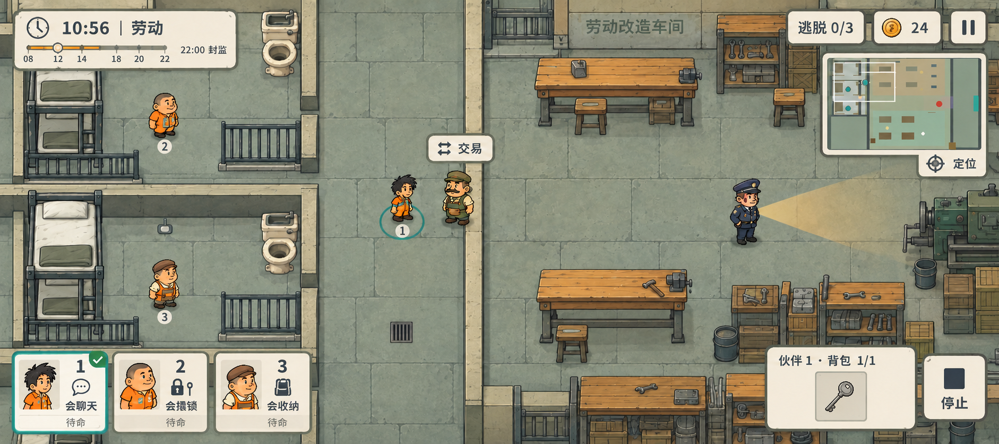

# A09 · 手机横屏全屏 UI 布局概念

日期：2026-10-05（Asia/Shanghai）  
执行：主美，成员 20df60dc-6f5f-40ca-930a-a606b45a0dac  
GameCreator 任务：3ee05e3b-4961-4ccb-ac9c-90b22eb2d45b  
状态：交付制作人审核；待用户认可。仅概念，未改运行 UI，未确认新的正式风格基线。



## 布局决定

监狱世界出血至画幅四边，取消永久标题、网页页头、右侧白栏和画面外围底板。HUD 为低对比米白纸卡，深墨轮廓、青绿选中态及轻阴影，与 FINAL-WARM-01 手绘场景相接。中央走廊、人物、商人和通路保留给观察及点击移动。

| 区域 | 常驻内容 | 使用方式 |
| --- | --- | --- |
| 左上 | 10:56、劳动、日程刻度、22:00 封监 | 一眼判断时段；点时钟进入完整日程 |
| 右上 | 逃脱 0/3、局内钱 24、暂停入口 | 目标和资源简记；原型工具收进菜单 |
| 右上下一层 | 小地图、摄像机可见区、友军/敌军标记、定位 | 小地图轻点/拖动查看；定位选中伙伴 |
| 左下 | 三名伙伴编号、肖像、独立技能徽章、待命/操作状态 | 三卡一触切换；当前伙伴青绿边框及勾角 |
| 右下 | 当前伙伴背包、停止 | 只显示选中者的物品格；停止当前伙伴行动 |
| 世界内 | 邻近目标的情境气泡 | 主概念为商人“交易”；门、狱警按真实条件替换图标 |

三卡示例技能为会聊天、会撬锁、会收纳。技能随机且可重复，不能按发型或体型固定能力。地图中保留选中圈与人物编号；没有牵手连线、摇杆、血条或战斗动作盘。轻点选人/空地移动、单指拖主图、小地图导航继续沿用现有操作。

画中 HUD 主要集中在角落，纸卡只包内容，不扩展成新的侧栏。中央过道与四位场景人物清楚；右下 HUD 可压住不重要家具，不压住关键操作点。实际摄像机跟随时仍需验证世界目标进入 HUD 边缘的情况，不能仅凭本静图承诺所有地图均无遮挡。

## 一格与三格背包

主概念选择伙伴 1（会聊天），显示“伙伴 1 · 背包 1/1”，下方只画一格钥匙。没有扩容能力者固定 1 格；会收纳者切换后才横排显示 3 格，标题按真实占用量显示如“伙伴 3 · 背包 1/3”。其他两张伙伴卡不重复背包。

格子只表达真实容量，禁止预留看起来可解锁的假空格。无物品时仅显示一格虚线空槽及 0/1；不摆出一排禁用按钮。点击已占用格子，在背包上方展开短动作面板：使用、放下、交给另一伙伴。交接对象通过人物编号和肖像辨认；条件不满足时给一行短原因。关闭后恢复紧凑常驻状态。停止按钮独立于物品动作，因此选物品、换人后也能快速停住当前人物。

## 菜单、日程、交易展开

- 暂停入口打开中间纸面菜单；关卡选择、音量、重新开始和开发者设置放在里面。正式发行隐藏开发者项，测试版本保留二级入口。主概念仅表现入口，是否由菜单暂停模拟需在实装时按玩法规则确定。
- 点时钟打开完整日程，列出 08–12 劳动、12–14 吃饭/休息、14–18 劳动、18–20 自由活动、20–22 归寝禁出、22:00 封监。轻量日程查看沿用当前时间流逝规则，不从概念推导暂停时间。
- 交易弹层居中，商品列表、买/卖及关门按钮均留在同一层。时钟/封监提醒保持可见；巡逻及时间继续。交易面板上方禁止穿插世界“交易”气泡、物品标签或路标。打开弹层时隐藏世界互动气泡，输入被弹层截获，关闭恢复。
- 展开完整地图时优先占用独立浮层，保留返回、定位与停止；正常状态的小地图仍可轻点/拖动，不使用边缘自动滚屏。
- 提醒用短暂条或纸签，不新增常驻操作说明。初次教学可出现选人/移动手势，学习完成后消失。

## 手机适配目标

概念原图 1882×836，比例约 2.251:1，接近 20:9（2.222:1）。它是视觉构图，不是可直接切图的精确像素控件规格。

后续实装按可用安全区独立布局，不把整张图等比缩成 UI：

- 上、左、右内边距建议 16 个界面逻辑单位，再叠加实际刘海/挖孔安全区；底部 20 个逻辑单位，再叠加手势条区域。具体单位与项目视口换算在实装任务确认。
- 选人卡、暂停、定位、停止、物品格和情境互动热区目标至少 48×48 个界面逻辑单位；高频停止/选人优先 56。视觉图标可小于热区；相邻热区至少 8 间距。
- 正文及状态目标 16，辅助刻度不小于 13，主时钟 24–28 个界面逻辑单位。不得把当前图片上的字直接当最终字体资产。
- 16:9 到较长横屏使用角落锚点；左下三卡控制在可用宽度 30% 左右。窄屏缩减卡片重复文字及收起小地图，保留三卡、停止及当前背包。长屏增加世界面积，避免拉长卡片。
- 一格背包面板按单格内容收紧；三格版本向左扩展并避开停止。弹层沿用同一安全区。
- 静图中暂停、定位及刻度缩到真实手机后仍可能偏小；这些必须按上述热区与字号重新排，尚未做真机触屏可读性验证。

## 生成与实际自检

工具：内置 image_gen（默认非透明背景），1 次主图生成、1 次有针对性的局部修订；没有 CLI、SVG/HTML 替代图，也没有程序编辑 PNG 像素。生成原图逐字节复制到工程。

主图参考：C:/Users/gst20/AppData/Local/Temp/codex-clipboard-98fe5777-2c77-471d-b01c-a380dbda7eca.png  
首图输出：C:/Users/gst20/.codex/generated_images/01a10ab4-5cf7-7c70-8247-13b529a3f2da/exec-324a1361-19a2-44ec-8c4a-155f7f0a38ac.png  
最终输出：C:/Users/gst20/.codex/generated_images/01a10ab4-5cf7-7c70-8247-13b529a3f2da/exec-3373d418-e614-4ae4-9676-815e8a00b0ca.png  
工程 PNG：E:/Project/Godot/这次怎么逃/art/concepts/ui-fullscreen/a09-fullscreen-hud-v01.png  
PNG SHA256：F3F64CDBC4815E2CE035F2823B79F772535BE62F483FF40F735D8BFBBA2F476F  
本说明：E:/Project/Godot/这次怎么逃/docs/art/a09-fullscreen-ui.md

已用 view_image 查看参考、首图及复制入工程的最终图，并读取实际尺寸及 RGB 格式：

- 满屏世界铺至四边，无网页标题、白色右栏、设备外壳或注释展示板。
- 三名伙伴可辨认，编号/技能/选中/状态相互独立；三个技能文字及背包、交易、停止、定位、10:56劳动、22:00封监可读。
- 首图误画第二空格，已定向修订；最终图只剩居中一格钥匙。
- 场景中选中伙伴、商人、狱警及主要通道没有被常驻 HUD 遮住。
- 修订提示要求同步校正日程进度，但模型没有可靠落实：最终时间刻度圆点仍在 12 附近，橙色条越过该点。此处只可作为日程条的外观参考；实装必须用真实时间计算，10:56 应落在 08–12 区间约 73% 处。
- 人物 3 的帽形/服装细节和部分家具是概念绘制变化，不作为替换已交付人物或新地图道具的要求。狱警光锥、小地图与门洞仅作表现示意，真实遮挡及规则由引擎维护。
- 图像未切成资产、未接入运行 UI；没有用该静图验证字体授权、设备安全区、真机字号、触屏误触或各地图跟随过程遮挡。

## 主图最终提示词

下列为主图请求原文；最终 PNG 另经下一节局部修订。

```text
Use case: ui-mockup. Asset type: final-looking mobile landscape gameplay HUD concept for the Chinese indie escape puzzle game 《这次怎么逃》.
Input image 1 is a style and existing-world reference, NOT a layout to preserve. Completely redesign its interface into a FULL-BLEED MOBILE GAME SCREEN, approximately 20:9 ultrawide, preferably 2304×1024. One single actual gameplay-screen concept, no phone/device shell, no presentation board, no external margins, no arrows or annotation captions. The prison world must extend to all four outer edges. No huge game title, no website header, no permanent white right sidebar.

STYLE: preserve FINAL-WARM-01 from reference: charming hand-painted 2D paper-cut comic prison with warm pale low stone walls, muted sage-gray flagstone floor, soft short contact shadows, ochre wooden workshop benches, jail-bar cell doors, bunk beds and small toilets. Horizontal/vertical world axes, shallow top-down view and upright compact cartoon sprites, NOT diamond-isometric. Keep fine hand-painted texture subdued. Three distinguishable friendly orange-clad inmates: slim messy black hair numbered 1, round bald numbered 2, square brown side-part numbered 3. One navy-uniform patrol guard at far-right with a faint forward amber vision/light cone that terminates at nearby walls. An olive/brown-uniform merchant nearby inmate 1. No violence, no blood.
SCENE: cell block on left third, broad open central corridor with all important characters and doorways fully visible, workshop occupying right half; high-quality coherent game art. The selected friendly inmate 1 stands near the merchant in the center-left corridor, with a clean small teal selection ring and little 1 badge. Friendlies 2 and 3 are separately visible inside/open beside their cells. Place HUD over spare peripheral flooring, never over the selected inmate, the merchant, guard, sole passage or door interaction point. Central 70% should read as a spacious interactive world.

HUD design: warm ivory folded-paper small floating panels, deep ink outlines with restrained soft shadows and generous readable Chinese sans-serif, sage dividers, teal selection accent, terracotta warning accent. No fantasy gold ornament or generic dark RPG panels. All tap targets should be visibly mobile-sized, icons clear, typography polished and exact. Avoid dense tiny copy.

UPPER LEFT: a compact two-line time plaque, clock icon, prominent “10:56” and “劳动”; below a slim orderly day-progress timeline with tiny labels “08”, “12”, “14”, “18”, “20”, “22”. One short clear subtitle “22:00 封监”. Do NOT suggest one-minute entire game deadline or show unrelated timer.
UPPER RIGHT: compact status chips “逃脱 0/3” and a coin icon “24”, plus one clean pause button with || symbol. Just below these a compact floating mini-map (roughly 12–15% screen width), matching the cell/workshop/corridor plan with teal inmate dots, small red enemy dot and outlined camera viewport. A small crosshair locate button integrated along the map's lower edge, short label “定位”. Minimap stays at edge and not huge.
BOTTOM LEFT: THREE compact side-by-side selectable portrait paper cards, all easily thumb-tappable, NOT a tall sidebar. Each shows its inmate portrait and fixed large number 1, 2 or 3, separate skill icon and exact skill text. Card 1 is selected with a teal border and small check/tab; exact text “1 会聊天”, secondary “待命”. Card 2 exact text “2 会撬锁”, secondary “待命”. Card 3 exact text “3 会收纳”, secondary “待命”. Skill icon speech bubble / lock-and-pick / backpack respectively. Identity and skill separate. Cards together occupy less than one-third of screen width.
BOTTOM RIGHT: selected-character inventory is a compact floating panel, exact title “伙伴 1 · 背包 1/1”, contains exactly ONE square slot showing a key, NOT three or ten slots, since selected character has no expansion skill. No redundant big backpack icon or grey disabled buttons. Adjacent one mobile-sized rounded square STOP button, solid square-stop symbol and label “停止”. Empty space remains between left selection cards and right inventory. Item action buttons should NOT be displayed in this closed normal state.
WORLD CONTEXT INTERACTION: above merchant near selected inmate show exactly one small ivory rounded interaction bubble with exchange-arrows icon and Chinese “交易”. The bubble is separate from permanent HUD, placed clear of face and corridor. No joystick, no health bars, no combat action wheels, no keyboard hints or developer buttons.
All Chinese strings exactly as quoted; avoid extra filler copy. Professionally art-directed game UI with hierarchy, safe corner margins, attractive hand-painted polish. This is a gameplay HUD concept, not a promotional poster.
```

## 唯一一次定向修订提示词

输入为上文首图，输出为最终工程 PNG。

```text
Use case: precise-object-edit. Edit this finished mobile landscape gameplay HUD concept with only TWO precise local corrections. Keep the entire prison scene, all characters, their positions, all full-bleed edges, style, colors, text, camera angle, left-bottom three cards, minimap, pause, stop and trade bubble unchanged.
1. BOTTOM RIGHT INVENTORY: title remains exactly “伙伴 1 · 背包 1/1”. This character has ONLY ONE inventory slot. DELETE the empty rectangular second slot that is currently to the right of the key. Instead show ONE square key slot centered under the title, about 90×90 at current resolution, with plain ivory panel background around it. There must be no second-slot outline, no second indentation, no phantom item slot. Preserve the inventory panel's overall location and title, and preserve the adjacent “停止” button.
2. UPPER LEFT TIME PROGRESS: preserve clock and exact “10:56 | 劳动”, labels “08”, “12”, “14”, “18”, “20”, “22”, and “22:00 封监”. Correct the small circular current-time marker to sit approximately 73% of the distance from the 08 tick to the 12 tick (10:56 is before noon). The warm orange elapsed part of the timeline must stop exactly at this circular marker, not extend to 14. Remaining timeline stays muted sage-gray. Change no other image content.
```

