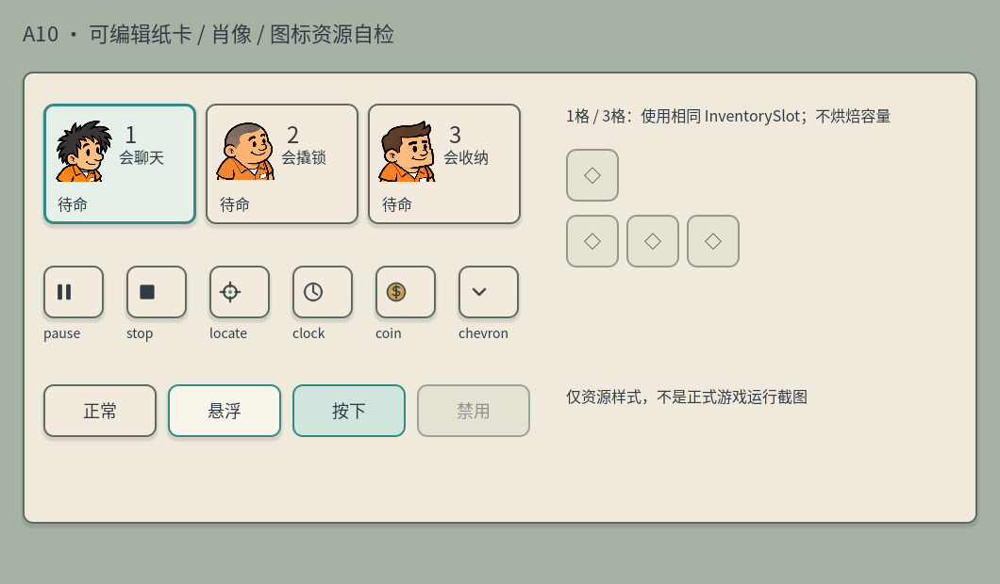

# A10 · 全屏浮动 HUD 素材与规格

日期：2026-10-05（Asia/Shanghai）  
执行：主美 20df60dc-6f5f-40ca-930a-a606b45a0dac  
任务：9e101654-14f2-47f3-a88e-101d3fe6d383  
状态：主美素材交付；制作人程序接入与整体验证独立完成。

用户已认可 A09 主概念并明确开始执行。此次把布局中的纸卡、图标、肖像变为可编辑资源；不烘焙整张概念，不改变 FINAL-WARM-01 角色/世界基线，也不修改 A09 原交付说明。



上图为 1060×620 的资源预览，不是正式游戏运行布局。纸卡、状态、三肖像及六图标已在 Windows D3D12 实际渲染并查看。

## 资源接口

共同目录：res://art/ui/fullscreen/

| 路径 | 内容 |
| --- | --- |
| theme.tres | Godot Theme，原生 StyleBoxFlat 可编辑样式；圆角抗锯齿、深墨线、暖纸底、短投影 |
| pause.svg | 暂停，双竖条 |
| stop.svg | 停止，实心方块 |
| locate.svg | 定位，准星与青绿中心点 |
| clock.svg | 时钟，指针和少量刻度 |
| coin.svg | 钱包资源，赭黄硬币及深墨符号 |
| chevron.svg | 下展开箭头 |
| portrait_1.tres | 角色 1 的上半身 AtlasTexture |
| portrait_2.tres | 角色 2 的上半身 AtlasTexture |
| portrait_3.tres | 角色 3 的上半身 AtlasTexture |

六 SVG 为本轮手工代码原生矢量，32×32，透明背景，线宽约 2–3。在 24 像素图标宽的按钮中已观察轮廓；无需把 SVG 先烘焙成 PNG。导入可由 Godot 正常资产扫描完成，本轮 QA 直接通过 Image.load_svg_from_string 验证 SVG 可解析并渲染，没有替换导入配置。

肖像复用现有 v03 原 PNG，只改变 AtlasTexture 取样区域。没有新生成/改像素，也不引入技能绑定外形：

| 肖像 | 来源 | 区域 x,y,w,h |
| --- | --- | --- |
| 1 | res://art/characters/inmate_01_handpaint_v03.png | 254,57,372,385 |
| 2 | res://art/characters/inmate_02_handpaint_v03.png | 201,92,353,345 |
| 3 | res://art/characters/inmate_03_handpaint_v03.png | 187,52,359,375 |

filter_clip=true，防止区域外像素渗入。肖像建议 TextureRect 显示 48×60 或 64×76，保留比例；头发及脸部完整，下缘切在上半身。编号、技能、状态另用控件绘制。

构建 TextureRect 时，先设置 expand_mode=EXPAND_IGNORE_SIZE，再赋 texture，最后设置控件尺寸；stretch_mode=STRETCH_KEEP_ASPECT_CENTERED，mouse_filter=IGNORE。自检初次试排发现赋纹理后才设 expand_mode 会留下初始最小尺寸缓存，导致原尺寸肖像溢出；已修正临时预览构建顺序并验证最终三个控件实际尺寸均为 64×76。

## Theme 变体与边距

theme.tres 引用 res://art/fonts/NotoSansCJKsc-Regular.otf，默认字 18。原字体来源/授权文件继续沿用 art/fonts/source-license.json 与 LICENSE.txt。

| theme_type_variation | 基类 | 内容边距 左右/上下 | 用途 |
| --- | --- | --- | --- |
| HudPanel | PanelContainer | 12/10 | 时钟、小地图、背包及弹层纸底 |
| HudChip | PanelContainer | 10/6 | 钱与逃脱简记 |
| PartnerCard | Button | 8/8（normal） | 普通伙伴卡 |
| SelectedPartnerCard | Button | 8/8（normal） | 青绿边框、淡青纸底的选中伙伴 |
| InventorySlot | Button | 6/6（normal） | 单格/三格统一槽样式 |
| QuietButton | Button | 10/8 | 暂停、停止、定位等小按钮 |

Button 通用 normal/hover/pressed/disabled/focus 已覆盖：悬浮亮纸青绿线，按下青绿色纸，禁用灰纸与半透明深墨字；focus 为透明中心、外扩 3 的青绿描边。SelectedPartnerCard 的 normal/hover 保持选中底色，pressed 显示按压反馈。PanelContainer/Panel 默认纸底；ItemList 列表选中、Tooltip 及容器间隔也提供同体系样式。

全局横向容器间隔 8，纵向 6；按钮图标最大宽 24，图标与文字间隔 8。按钮最小热区由程序 custom_minimum_size 决定，Theme 不将手机尺寸写死。

建议普通伙伴卡 150×104 起，三卡并列；头像靠左、编号/技能靠右、状态下方。自检图用 162×128 稍大展示，不能据此固定正式布局。普通字号 16–18；主时钟可覆盖至 24–28；低频刻度目标至少 13。触屏目标至少 48×48，常用停止/选人建议 56；实际安全区、DPI 与窗口缩放由程序验证。

## 对已认可布局的接入约束

- 世界满屏，卡片包内容，保留中间点击移动/拖镜头的空间。UI 吸收自身输入，空白容器不要阻挡地图。
- 三张伙伴卡保持固定编号/肖像与可替换随机技能，选中和持续操作分别反馈。
- 只为选中者生成真实容量：普通角色 1 槽、会收纳 3 槽。空槽不摆出四个禁用动作按钮；选物品后才展开使用/放下/交接。
- 小地图旁保留定位，停止独立于背包展开；暂停入口收纳音量/日程/重开/关卡切换/调试。
- 日程条按真实时间绘制，不复刻 A09 静图圆点的示意偏差。10:56 应在 08–12 区间约 73%。
- 日程/交易弹层与世界情境气泡分层；弹层打开时收起下层互动提示并截获输入。交易时钟与巡逻规则不由美术资源改变。
- SVG 和 Theme 不改变现有角色、地图碰撞、选择方式、时间或警戒规则。

## 自检与边界

报告：
- E:/Project/Godot/这次怎么逃/docs/art/a10-resource-qa.json：headless，23 项通过。
- E:/Project/Godot/这次怎么逃/docs/art/a10-resource-qa-native.json：Windows D3D12，24 项通过（含保存预览）。
- E:/Project/Godot/这次怎么逃/docs/art/a10-resource-preview.png：实际查看的资源预览。

临时 QA 脚本：C:/Users/gst20/AppData/Local/Temp/a10_ui_resource_qa.gd，未放入共享程序目录。检查 Theme/字体默认值与边距、四种 Button 变体、三 Atlas 加载/区域边界/裁切、六 SVG 解析和尺寸、三肖像控件实际 64×76 尺寸。原生渲染后保存预览并逐项查看。SVG QA 是直接解析，正常工程 ResourceLoader 的导入扫描由接入方完成。

执行命令（工程目录 E:/Project/Godot/这次怎么逃）：

```powershell
& 'E:/Godot/4.7/Godot_v4.7.2-stable_win64_console.exe' --headless --path . --script 'C:/Users/gst20/AppData/Local/Temp/a10_ui_resource_qa.gd'
& 'E:/Godot/4.7/Godot_v4.7.2-stable_win64_console.exe' --path . --script 'C:/Users/gst20/AppData/Local/Temp/a10_ui_resource_qa.gd'
```

三原 PNG SHA256 与原 manifest 一致：
- 1：4c0d4140b2cb5b51770590ba2ce63cc51a89dd0c271d0b199e87b7ace1003719
- 2：27f971409434fa0d40231cf4de853769e7e83d24169f544c3f76951bd367daba
- 3：08ade4e92c31305191e3df0cb582844b79502de104aa31eae3325a6e151d0445

主美只新增 art/ui/fullscreen/** 与 docs/art/a10-*，没有修改 scripts/scenes/data/project.godot，没有执行 Git 提交/推送。未将资源预览当作游戏实装验收；真机操作、布局缩放、弹层输入、全屏摄像机和原玩法回归由制作人集成任务验证。

