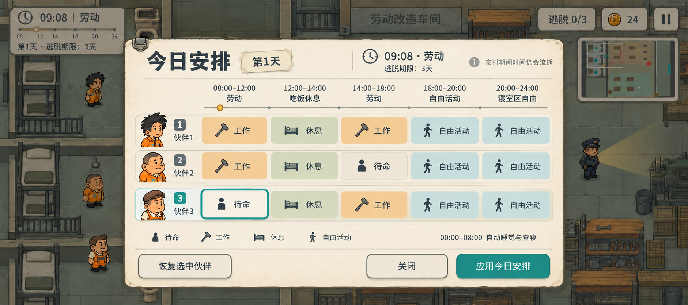

# A11 · 日常表重设计概念

日期：2026-10-05（Asia/Shanghai）  
主美：20df60dc-6f5f-40ca-930a-a606b45a0dac  
GameCreator 任务：13de730b-bafb-4413-b24a-d2731a4d54a7  
状态：概念交付制作人技术审核；等待用户评价。本轮未实施运行界面，未确认新的视觉基准。



## 布局与视觉层级

旧 P36 五行三列的等权下拉表，改为三名伙伴各一行、五个时段共用横向日程刻度。角色肖像和编号先建立“在给谁安排”，随后从左到右读此人的一天。活动以图标、短文字和柔和色块区分，没有每格常驻下拉箭头或密集行政表线。

宽幅象牙纸面浮于适度压暗的全屏监狱世界上；细深墨轮廓、轻纸纹和短纸影沿用 A09 已认可风格。当前选中伙伴3与其上午“待命”段描青绿，工作赭黄、休息灰绿、自由活动淡青、待命纸白。颜色同时配图标与文字，不能独自承担语义。

标题“今日安排”最高层；第1天、09:08劳动、3天期限为次层信息；五时段标题与活动行是核心；底部图例/午夜注释低一级；“应用今日安排”是主要动作，“恢复选中伙伴”和“关闭”为次动作。图中背景只为游戏氛围，世界互动气泡不穿到弹层上。

## 与当前玩法一致

| 时段 | 图中标题 | 可选活动 |
| --- | --- | --- |
| 08:00–12:00 | 劳动 | 待命 / 工作 / 休息 / 自由活动 |
| 12:00–14:00 | 吃饭休息 | 待命 / 休息 / 自由活动 |
| 14:00–18:00 | 劳动 | 待命 / 工作 / 休息 / 自由活动 |
| 18:00–20:00 | 自由活动 | 待命 / 休息 / 自由活动 |
| 20:00–24:00 | 寝室区自由 | 待命 / 休息 / 自由活动（在寝室区） |

00:00–08:00 自动睡觉与查寝只在底部注释，不增加第六编辑栏。屏幕示例第1天09:08劳动，默认逃脱期限3天；不继承旧 A09 的22点单日期限。面板提醒“安排期间时间仍会流逝”，仍是当前活跃面板，不新增暂停规则。

三条计划只是已有活动的视觉示例，不能当作推荐必胜方案。身份和随机技能分开；此面板没有技能标签，活动仍不依赖外貌。未新增疲劳、产量、工资、生产收益、人员NPC或其他玩法。当前/未来时段可编辑、过去/已逃出/午夜只读及 R01–R03 无岗位工作禁用等限制保持 P36 原规则。

## 如何编辑；图例与选项的区分

点人物行中的某一个活动段，再弹出该段的轻量选项菜单。四种候选为待命、工作、休息、自由活动；工作仅第一/第三时段可用，无岗位地图工作禁用。选项可用四个带图标的行或简洁气泡，触屏大目标；显示在点击段附近，必要时钳制到面板安全区，不压住主按钮。关闭菜单后只留下新活动图标、名称和选中描边。

主概念展示的是“菜单收起、伙伴3上午段已选中”的状态，不绘制额外编辑弹层。底部待命/工作/休息/自由活动一行是**非交互图例**，只解释图标与底色，没有按钮框、按压态或全局活动刷。不得将它实现成新的常驻编辑机制，也不把轻量选项和图例混用。

点击段选择草稿，不直接替代“应用今日安排”；应用继续沿用 P36 当前时段改变才执行的行为。“恢复选中伙伴”继续恢复被玩家接管的当前安排，不能画成清空整张表或恢复所有人。手动接管、下时段恢复自动活动、次日清表、路线受阻等仍按原系统执行。

## 手机尺寸与层级目标

概念图是 1882×836，约2.251:1，接近20:9。它提供视觉层级与构图，不是直接切成可点击控件的截图。

正式实现需在手机安全区内重新布局，不能简单把本图等比缩小：活动段、菜单选项和底部按钮不得低于48×48个界面逻辑单位；重要应用按钮/高频选择优先56高度，间隔至少8。正文目标16–18，时段可用更紧凑08–12表示并提供完整信息，不以缩小到难读字号强塞。

宽横屏三人物行同时可见，左侧身份列保持稳定，五活动段按触屏可用宽分配；等宽段是可点击区域，不声称时间跨度成比例。较窄横屏优先增加面板占屏宽度或允许活动带横向查看，保留身份列和底部应用/关闭，不能把活动热区缩到48以下。画中进度点只表示当前上午劳动段，精确时间位置由实际时钟计算；背景HUD刻度不是本概念交付的功能验收。

弹层应吸收输入并隐藏世界情境气泡，防止误移动；打开安排表时游戏时间/角色/AI继续，与当前 P36 规则一致。主概念未做真机可读性、拇指遮挡、误触或跨分辨率的程序验证。

## 生成、自检与修订

工具：内置 image_gen，非透明背景。一次主图生成及一次局部角色修订；没有CLI/HTML/SVG替代整图，没有程序修改 PNG 像素。先 view_image 查看三个UI参考和角色3原图，再查看最终复制入工程的PNG。

参考：
- E:/Project/Godot/这次怎么逃/docs/tests/p36-native-1200-routine-table.png（真实功能现状）
- E:/Project/Godot/这次怎么逃/docs/tests/p36-native-1600-overview.png（实际全屏背景）
- E:/Project/Godot/这次怎么逃/art/concepts/ui-fullscreen/a09-fullscreen-hud-v01.png（已认可风格）
- E:/Project/Godot/这次怎么逃/art/characters/inmate_03_handpaint_v03.png（局部身份修订参考）
- 当前规则与资源文档：docs/dev/p36-daily-routine.md、docs/art/a09-fullscreen-ui.md、a10-fullscreen-ui.md。

已实际检查：
- 五组准确且唯一的时间范围08–12/12–14/14–18/18–20/20–24，三个伙伴行，没有重复时段或第六编辑栏。
- 标题、活动词、3天期限、时间流逝提醒、午夜自动睡觉查寝、三个操作按钮中文可读，无发现明显误字。
- 工作只在上午/下午劳动段出现，晚间列明确寝室区自由；选中段/伙伴的青绿与活动底色可区分。
- 一次局部修订恢复了背景伙伴3的棕侧分发型与橙衣。面板内伙伴3小头像仍有 A09 的帽形风格偏差，修订没有完全落实；这不是人物身份改造要求。正式实施继续复用 A10 portrait_3.tres 指向当前原PNG肖像，三人身份资产不变。
- 底部是一行图例，未摆出15个下拉菜单，也未新增常驻编辑工具。静图不模拟菜单打开/点击结果。
- 技术检查与制作人概念交付验收，不等于用户视觉认可或运行实装。未改 scripts、scenes、Theme、data、project.godot、旧图或正式视觉基准，未提交/推送Git。

主图生成原件：
C:/Users/gst20/.codex/generated_images/01a10ab4-5cf7-7c70-8247-13b529a3f2da/exec-0ea2425b-4fb1-4688-b250-3740e84c24b0.png

修订最终原件：
C:/Users/gst20/.codex/generated_images/01a10ab4-5cf7-7c70-8247-13b529a3f2da/exec-3eace622-ba85-43f5-aa2b-268eea6ec2d0.png

工程交付：
E:/Project/Godot/这次怎么逃/art/concepts/ui-routine/a11-daily-planner-v01.png  
尺寸：1882×836，RGB，背景非透明。  
SHA256：9E728B1409ABFC8B5B9285CC2CACB4C21D5EE5081AE5A7571442BCDAC76C53DB  
说明：E:/Project/Godot/这次怎么逃/docs/art/a11-daily-planner.md

## 完整主图提示词

```text
Use case: ui-mockup. Redesign the DAILY ROUTINE PLANNER modal interface for the Chinese mobile landscape prison escape puzzle game 《这次怎么逃》. Output ONE polished complete mobile landscape gameplay-screen concept, approximately 20:9, preferably 2304×1024. Not a phone shell, not a poster, not a presentation board, no annotations outside the game.

Input images: image 1 = current actual routine-table UI, use it ONLY to understand functions and current game characters, do NOT preserve its administrative dropdown-grid layout. Image 2 = actual full-screen prison world reference. Image 3 = approved warm hand-painted full-screen art/HUD style reference. Preserve the warm ivory paper, deep gray ink, sage-gray prison floor, warm low stone walls, subdued ochre and teal selection of image 3; do NOT copy its obsolete 22:00 deadline or 10:56 clock.

BACKGROUND: full-bleed hand-painted prison game reaching all four edges; low warm stone walls, cells with bunk beds/toilets on left, wooden workbenches on right, three compact orange-inmate cartoon characters and one navy guard. Softly dim the entire world behind the modal with translucent gray-green veil, but keep setting recognizable. Background HUD restrained/dim. No joystick, weapon panels, fatigue bars, wages, production rewards or new systems. Correct current clock example: day 1, 09:08, labor; normal escape deadline is THREE DAYS, not one-day 22:00 closure.

PRIMARY UI: a beautifully art-directed broad horizontal cream-paper daily planner centered with comfortable mobile safe margins. Soft irregular paper edge, restrained inner line, slight bottom paper shadow, generous whitespace and excellent Chinese sans-serif type. Optional understated little metal clip at upper-left, do not decorate heavily. Treat this as a character planning board, NOT a spreadsheet. No 15 identical outlined dropdown boxes, no dense crosshatched grid, no dropdown arrow at every cell. Use THREE readable character rows, each with a portrait and a continuous colored itinerary ribbon broken lightly into FIVE aligned day-period segments. Row identity stands out; segment task ICON + short Chinese activity name, not intimidating form fields. A selected task has one teal outline only. Warm ochre WORK, sage REST, pale teal FREE ACTIVITY, ivory WAIT. Flat polished hand-painted UI texture, readable contrast, no black/gold fantasy ornament.

HEADER: big title EXACT “今日安排”. Beside it a small paper tab EXACT “第1天”. At right a small clock icon and clear “09:08 · 劳动”, one subtitle EXACT “逃脱期限：3天”. A small restrained live-clock reminder EXACT “安排期间时间仍会流逝”. Avoid decorative invented slogans.

TIMELINE HEADINGS above the ribbons: exactly FIVE chronological sections, each time on one line, readable phase below. In exact order:
1 “08:00–12:00” / “劳动”
2 “12:00–14:00” / “吃饭休息”
3 “14:00–18:00” / “劳动”
4 “18:00–20:00” / “自由活动”
5 “20:00–24:00” / “寝室区自由”
Draw one fine continuous horizontal day rule beneath headings, gentle separator markers. The first labor heading alone has a tiny ochre current-time dot, since 09:08 is morning labor. DO NOT draw a second duplicate row of time labels. Do NOT make night a sixth editable column. FIVE columns only. Modestly equal presentation width is acceptable for touch accessibility; no claim duration proportions.

CHARACTER ROWS: left margin inside panel contains three small friendly half-body portraits (not full-body interfering sprites), clear ink number badges and EXACT “伙伴1”, “伙伴2”, “伙伴3”. Portrait 1 messy black hair, portrait 2 round short/bald hair, portrait 3 brown side-part hair WITHOUT CAP, all orange uniforms. No skill label is needed on this screen; abilities remain random and do not define the daily plan. Current selected person is partner 3, subtle teal identity marker. No fourth person row.

Itinerary content, each ribbon exactly five task segments with clear simple icons: small hammer/workbench=工作, bed/cup=休息, single-person upright waiting=待命, small walking person=自由活动.
ROW partner 1: “工作”, “休息”, “工作”, “自由活动”, “自由活动”.
ROW partner 2: “工作”, “休息”, “待命”, “自由活动”, “自由活动”.
ROW partner 3: “待命”, “休息”, “工作”, “自由活动”, “自由活动”.
Select ONLY the first segment “待命” in partner 3 row with a teal outline. All activities are pre-existing selectable choices, not rewards. Only first and third time columns contain 工作. Keep fifth phase title 寝室区自由 and task label 自由活动 (thus explicit freedom inside dormitory only).

At bottom of planner below ribbons, one small icon legend line EXACT “待命 / 工作 / 休息 / 自由活动”. Nearby one compact note EXACT “00:00–08:00 自动睡觉与查寝”. Night is a note, not another editor row.
Footer BUTTONS, mobile-sized at least 48px tall and generously spaced: secondary left EXACT “恢复选中伙伴”, secondary right-center EXACT “关闭”, primary teal right EXACT “应用今日安排”. Primary action looks most prominent, but not huge. No additional save/reset/auto-fill buttons, no action choices menu overlay obscuring ribbons. Minimal readable typography, no invented features.

All Chinese text is exactly the specified text; all five time ranges must be accurate, unique, and chronologically ordered. Genuine professional UI concept with clear hierarchy, warm painterly materials, excellent alignment, satisfying visual rhythm, large thumb-friendly activity hit areas, not a wireframe. Keep the modal and world from overlapping meaninglessly: world interaction bubbles are hidden while the planner is open.
```

## 唯一局部修订提示词

```text
Use case: identity-preserve / precise-object-edit. Image 1 is the finished daily planner UI concept to edit. Image 2 is the EXISTING third friendly inmate character sheet, only a visual identity reference. Make ONE narrow character-identity correction to image 1: the THIRD partner's small portrait at far left of the BOTTOM character row, immediately beside the teal “3” badge and “伙伴3”, must match image 2's brown swept SIDE-PART HAIR, square head, thick eyebrows and orange prison shirt. He wears NO HAT, NO CAP, NO helmet. Remove the current cap-like head shape. Draw a neat brown side-part hair silhouette like image 2's first standing pose and orange collar/shirt. Also the same third inmate standing in the dimmed background at LOWER LEFT should have the same brown side-part hair without a cap and orange uniform. Only these two small third-character drawings change.
PRESERVE every other pixel-level layout and content as closely as possible: all Chinese text, all time ranges, exactly three partner rows and five activity columns, icon positions, colors, paper textures, shadows, first two portraits, header, footer, teal selected first task in third row, world architecture and guard. Do not redraw the interface, add text, change labels, rearrange timeline or add columns. Keep landscape aspect and exact original composition.
```

