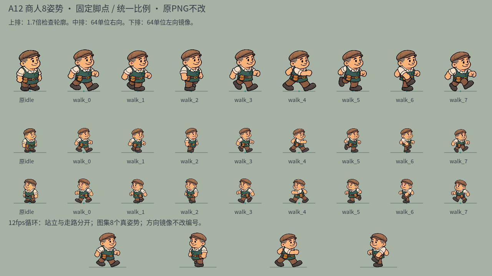

# A12 · 商人逐帧行走动画交付

日期：2026-10-05（Asia/Shanghai）
主美：20df60dc-6f5f-40ca-930a-a606b45a0dac
任务：ee12d268-9e8e-4cb1-a4f1-032386940126
交付：八个独立右向/三分之四步态，12fps，0.667秒循环；原 idle 不变。主美资源待制作人验收，程序集成独立处理。



## 资源与接入

- res://art/characters/merchant/walk_v12/manifest.json
- res://art/characters/merchant/walk_v12/merchant_walk8_v12.png
- PNG：1774×887，RGBA真透明，8帧4×2布局，无地面影子。
- fps=12；world_height=64；统一 scale_height=417.84457478。每帧独立 region / anchor 见 manifest，不用共享大裁框混进邻帧。
- 旧 idle 继续使用 docs/art/inventory-assets-v07.json 的 merchant 定义。身份为棕帽、灰鬓、奶白短袖、青绿围裙、棕裤、腰包、金扣与黑鞋的原商人，无新增胡须、道具或服装体系。

绘制契约：

```text
scale = 64 / walk_animation.scale_height
destination_position = world_foot - frame.anchor * scale
destination_size = frame.region.size * scale
source_region = frame.region
```

所有帧使用同一个 scale；不得按每帧 region.height 重算身高。anchor 是局部坐标，帽/头中心轴与最低鞋底注册到共同世界脚点；左向仅围绕脚点镜像身体，文字/UI不镜像。实际位移时切换步态，零位移回原idle；暂停是否冻结由程序处理。源图没有烘焙地面影子，仍由原表现系统画一次。

## 生成与检查

内置 image_gen 生成8个新姿势，没有从 idle 平移/缩放/扭曲伪造帧。首图后半周期前后腿及手臂重叠过于接近前半周期，因此通过内置 image_gen 定向修改下排4帧，强化前伸手臂、支撑脚、过腿抬膝和第二步。完整请求保存在 a12-imagegen-prompts.json。

最终 PNG 逐字节复制，SHA256：
c921dd9ea9c8896a793849396564b01374ed4c506e1c9c2fb4701eb1191a72f8

原 merchant_idle_v07.png 哈希仍为：
61e43132d13615bf4c712fb16038f4fee03c9bb7d436163919a3d7826b55f7ed

a12-register-frames.py 只读取源图 alpha，写 region/anchor/标定元数据与文本QA。没有保存重采样、插值、合成或改色的角色PNG。八帧有不同下半身轮廓，腿部宽窄、弯膝与前后手势可见。唯一轮廓不是步态正确的充分证明，另已查看原图和实际联系表，确认身份、八姿势区别、帽/衣着与脚点。

定量检查（a12-qa-resources.json）：
- 源图与复制PNG完全一致，RGBA真透明。
- 8种不同下半身 alpha 轮廓；每帧区域内没有邻帧不透明像素混入。
- 帧间头宽差2.42%，可见身体高度差5.57%，低于沿用v09的6%身体/8%头宽资源检查阈值。这是生成步态的自然高度变化，不是逐帧变尺度；没有承诺零抖动或逐像素相同。
- 旧idle可见高度63.258世界单位，新步态中位可见高度同为63.258；各帧约60.807–64.330。抬膝高点仍有约3.5单位自然起伏；脚底注册误差0（元数据原点）。
- 保留全部8个独立生成姿势，未把两个姿势重复填充至8帧。

独立 Godot 4.7.2 QA：
- a12-qa-godot-headless.json：38项通过，实际Image/AtlasTexture及 region、anchor、8帧、fps和统一比例检查。
- a12-qa-godot-native.json：Windows D3D12 40项通过，包含联系表保存及48次12fps显式帧推进（6个循环）。
- a12-contact-1280x720.png 已实际 view_image 查看。上排1.7倍轮廓、中排64单位右向、下排64单位左镜像，前列原idle用于对比。所有帧人物身份可辨，鞋/腿和手臂有区别，无邻帧碎片或双地影；脚点在同一基线。
- 原生预览同时运行了循环，但本交付不将自动推进等同真人感受、真机验证或完整游戏停走验收；制作人另检查实际商人移动/暂停/停止/镜像。

临时QA脚本路径：
C:/Users/gst20/AppData/Local/Temp/a12_merchant_resource_qa.gd
运行命令：
```powershell
python docs/art/a12-register-frames.py
& 'E:/Godot/4.7/Godot_v4.7.2-stable_win64_console.exe' --headless --path . --script 'C:/Users/gst20/AppData/Local/Temp/a12_merchant_resource_qa.gd'
& 'E:/Godot/4.7/Godot_v4.7.2-stable_win64_console.exe' --path . --script 'C:/Users/gst20/AppData/Local/Temp/a12_merchant_resource_qa.gd'
```

临时QA曾错误调用 PackedByteArray.hash，改为全局hash后通过；源图文件加载在隔离QA输出开发环境提示，不代表正式资源导出方式，生产应沿用引擎资源导入/加载。联系表是Godot绘制真实图集，不把原idle变形作为动画。

## 交付文件

1. art/characters/merchant/walk_v12/merchant_walk8_v12.png
2. art/characters/merchant/walk_v12/manifest.json
3. docs/art/a12-imagegen-prompts.json
4. docs/art/a12-source-license.json
5. docs/art/a12-register-frames.py
6. docs/art/a12-qa-resources.json
7. docs/art/a12-qa-godot-headless.json
8. docs/art/a12-qa-godot-native.json
9. docs/art/a12-contact-1280x720.png
10. docs/art/a12-merchant-walk.md

编辑器生成的 .import 可按工程规则跟随资源；未手工修改。只在新walk_v12与a12文档范围制作，没有改旧PNG、程序/场景/配置，不执行全工程同步，不commit/push。原idle和已确认风格基准保持。
