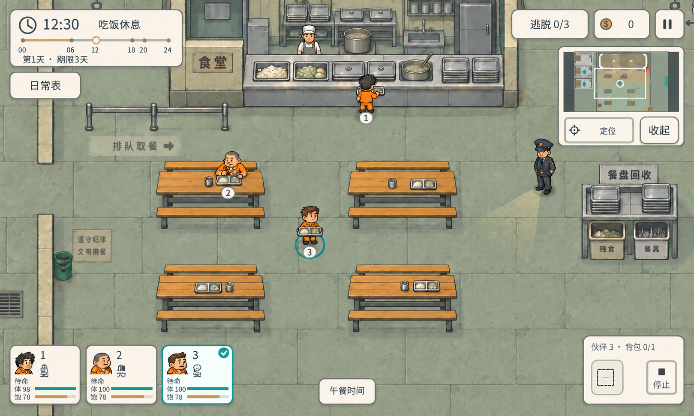

# A13 · 监狱食堂概念（朴素配餐修订版）

日期：2026-10-05（Asia/Shanghai）\
主美：20df60dc-6f5f-40ca-930a-a606b45a0dac\
任务：f8548250-e6e4-4267-9b03-5c6bbe4e41b0\
状态：概念图交付制作人审核，用户决定方向；本轮没有实施食堂地图或成品模块。

## 用户反馈与本版修改

用户看到首图后反馈：“这个伙食看起来太好了。这里是监狱，不应该伙食这么好的，反馈一下。”

据此用内置 image_gen 对全部食物做定向修改，而不是只修一个桌盘。最终表现为统一的朴素配给：少量白米饭/粗粮感米饭、低饱和灰绿煮菜与淡黄土豆、寡淡清汤。窗口仅两种开放配给盆，其余菜盆盖起；取消肉丸堆、亮橙绿色拼盘与丰富自助餐效果。后厨锅里也是清汤，彩色原料罐换成朴素金属储物罐。三名伙伴手持/坐席餐盘、所有桌上餐盘和回收桶残食都统一。旧铝盘、简单金属杯/餐具强化监狱日常，不画腐坏或污秽猎奇。

本版不定义食品数值、饱食恢复、定价或新的伙食系统。配餐修改是视觉主题反馈，不借概念改变玩法。

## 可落地的空间方向

沿最新1200×720游戏参考，采用水平/垂直轴线、偏俯视2D手绘卡通及现有的小人物/家具比例。灰绿石地板、暖木长桌、浅暖低墙和深墨轮廓保持当前监狱语言，没有改成等距菱形、摄影室内或大型写实插画。

| 区域 | 概念内容 | 作用 |
| --- | --- | --- |
| 上方中部 | 取餐台、浅盆、汤锅、餐盘堆 | 一眼认出食堂；三伙伴可在窗口取餐 |
| 后厨 | 低隔断、炉灶/锅、洗池、架与冷柜 | 提供后勤层次，保持窗口外路径清楚 |
| 左侧 | 低墙入口开口、短队列栏/提示 | 入场排队，同时能走旁路 |
| 中央 | 2×2四张长桌，长凳与少量餐盘 | 清楚坐席与就餐，没有塞满桌椅 |
| 中央及外围 | 连续宽过道、转弯空间 | 适合手机点选人物/地面移动 |
| 右侧 | 餐盘回收架、少量残食桶与餐具桶 | 取餐—坐下—回收的视觉闭环 |
| 右侧空地 | 深蓝狱警观察点 | 能观察取餐及主通道，未新增瞭望塔 |

表现12:30午餐：伙伴1取餐、伙伴2坐下就餐、伙伴3持餐盘在中央通道移动；伙伴3青绿圈、卡片和背包标题一致。人物与随机技能分开，不按外貌决定吃饭能力。

供后续关卡安排的空间目标是主要通路约80–100参考逻辑单位或更宽，关键转弯/队列旁路留裕量。它们是设计意图，图像不是精确地图坐标或碰撞测试。入口、桌凳注册、用餐点、取餐/回收点和动态角色避让需另行建图/寻路验证后确认。

白围裙后厨身影仅环境示意，不是已批准的新可操作NPC/厨师系统或角色资产。食堂出入口、桌凳、服务台、回收架、餐盘和标识都还未切成资产，也未启用到任何关卡。

## 现有 HUD 只是参考

保持既有时钟/日常表、目标/钱包/暂停、小地图、三伙伴卡、背包单格/停止的角落布局，没有另做UI设计。主体仍是食堂。

图中文字“食堂”“排队取餐”“餐盘回收”“午餐时间”等用于简洁认场。局部修订删除遗留活动大厅字样并开出左门口，卡片选择从1改到3，背包也指向3。

生成图的小刻度和技能小字不是正式UI字库或控件结果，仍有字形/刻度示意偏差；不因此替换当前运行HUD。时钟12:30、吃饭休息和3天期限可读。正式实施沿用现有UI，由真实数据驱动所有状态。概念图不是引擎实际运行截图，没有证明手机触屏/镜头跟随遮挡/守卫视野裁切。

## 生成来源与实际检查

使用内置 image_gen，非透明背景：一次主生成、一次入口/残留标签/选择整理，以及用户明确提出伙食主题修订后的一次配餐编辑。所有修改通过 imagegen完成，没有用代码编辑PNG。

已经 view_image 查看最新游戏参考、用户伙食反馈参考、阶段图与最终复制到工程的图。实际检查最终：
- 仍为俯视横竖轴线；四张暖木长桌保留，中央与左右路径通畅可见。
- 左墙有清楚入口开口，队列一侧保留空地；窗口后厨和餐盘回收区完整。
- 菜盆不再多色拼盘，肉丸盆改盖盆；只留朴素饭菜和清汤。
- 伙伴1/3托盘、伙伴2餐盘和所有桌盘均为同类低饱和配餐；回收桶也不再满载彩色饭菜。
- 伙伴3场景圈/卡片/背包一致，人物未被小地图/背包盖住。
- 不把静图可见空地当成已验证通路，未做程序/真人或真机测试。

最终PNG尺寸1619×971，比例约5:3，保留生成原图而未强制缩到1200×720；RGB、1909494 bytes。主图与原件归档均逐字节相同：

主图：E:/Project/Godot/这次怎么逃/docs/art/a13-cafeteria-concept.png\
原图归档：E:/Project/Godot/这次怎么逃/art/concepts/cafeteria_v13/cafeteria-ration-v01.png\
SHA256：896F5D3D6CF3A67EA917BA1F05D1C1CB082C98AAF8F5FD67FF8414A15BDADB23\
完整主图/两次编辑提示词、来源链和用户原话：E:/Project/Godot/这次怎么逃/docs/art/a13-imagegen-source.json\
最终生成原件：C:/Users/gst20/.codex/generated_images/01a10ab4-5cf7-7c70-8247-13b529a3f2da/exec-bb327f51-e1b0-42b0-8be8-47da210bb1f6.png

所查适用工程祖先、art及art/concepts未发现AGENTS.md；读取GameCreator职责规范和imagegen技能。只新增任务允许的docs/art/a13*和art/concepts/cafeteria_v13/**，没有改程序/场景/data/UI/旧PNG/正式风格/项目配置，也没有提交或推送Git。制作人验收的是概念交付；场景实施与用户视觉认可分别处理。
