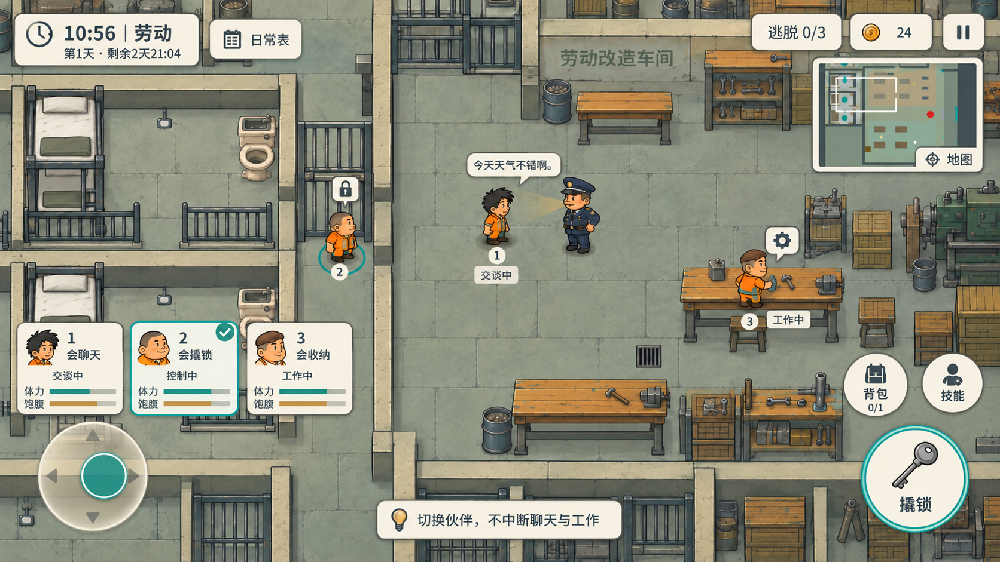

# A15 · 手机横屏摇杆UI概念

2026-10-06，主美。A15为本地工作包编号；用户直接授权本轮概念设计。GameCreator服务不可用，本轮未登记任务、未提交签名反馈、未验收，未发布风格或应用到游戏。仅供制作人和用户看图决定方向，游戏控制尚未修改。

沿用灰绿俯视监狱、暖木家具、橙色囚服与奶油纸卡，全屏世界铺到四边。选择只控制输入：此图控制伙伴2靠近锁门，伙伴1继续和狱警交谈，伙伴3继续工作，换人不会中断其他人的持续操作。随机技能独立于外貌；体力/饱腹只消费已有属性，不增设战斗血条。

| 触区 | 布局与操作目标 |
|---|---|
| 左下 | 半透明摇杆只驱动当前人物，松开归中；不承担拖镜头功能 |
| 摇杆上方 | 三张并列紧凑伙伴卡，一触切换；编号/技能/体力/饱腹/状态同时可见，当前卡青绿描边 |
| 右下 | 大情境交互键优先，图示靠近锁门时为“撬锁”；其上分开摆“技能”和“背包” |
| 左上 | 时间、当前时段、三天期限剩余时间、日常表入口 |
| 右上 | 逃脱目标、钱、暂停和紧凑小地图，保留查看/定位入口 |
| 中下 | 短提示避开两拇指区；教学完成后可消失，非永久长操作说明 |

主键按附近实际可操作目标变换，不把所有机关动作铺成一圈常驻按钮。“技能”是当前人物能力/目标选择的辅助入口，详细行为待正式交互方案确认；不从此静图推导新技能。背包入口只显示当前真实容量，图示普通角色0/1；会收纳角色切换后才显示三格。点击背包展开时再出现物品和相关动作，主图无假空槽。

后续手机触区建议：安全区左右/上方至少16–24逻辑单位、底部至少24并叠加系统手势条；主键至少88×88，摇杆直径112–136，辅助键及伙伴卡点击区域至少56×56。左右拇指区域独立，摇杆与卡片、主键与辅键热区至少间隔12–16。正文目标16–18，辅助文字至少14；正式布局按安全区分别锚定，禁止将概念整张等比缩小后直接当控件。窄屏可收起小地图，保留三卡和左右核心输入。多指时左侧移动与右侧交互分别捕获输入；切人瞬间先释放旧角色移动输入，持续工作/聊天状态不随选择改变。这些仅为接入建议，尚未真机测试。

## 来源、自检及概念限制

内置imagegen生成一次、定向修订一次；没有CLI图像API、Python绘画/改图或SVG替代。最终PNG逐字节复制自工具结果。准确主提示词、编辑提示词和三张参考路径保存在 `a15-imagegen-source.json`。

最终图：`E:/Project/Godot/这次怎么逃/docs/art/a15-mobile-joystick-concept.png`，1672×941，RGB，约16:9。SHA256：`EB4ABBD6691206AB9A316DD911FDAE9A09DB0B192461FF55DD3D2EAFA413202E`。

已用view_image实际查看两版与工程最终PNG：三卡状态、左下摇杆、右下主键/辅键、时钟/日常表、目标/钱/暂停/小地图完整；中央门、选中者、交谈双方及工作者没有被HUD遮住。10:56/劳动/第1天/剩余2天21:04、会聊天/会撬锁/会收纳、体力/饱腹、交谈中/控制中/工作中、背包0/1、技能与撬锁文字可读；三天期限未替换成旧版一天封监规则。修订已拉开右侧按钮间距，并将交谈狱警的光锥方向改向伙伴。

人物3仍有概念头发近似帽形的偏差，不是批准新人物形象；正式实现应复用A10肖像和现有角色PNG。背景家具、锁门布局、光照/小地图均是表现示意，不修改地图或规则。比例尺寸和文字可读性尚未做手机实机触屏验收，不能把生成图片直接切成全套UI资产。只新增本轮a15文档/概念PNG，未修改游戏代码、配置、旧图，未提交或推送Git。
