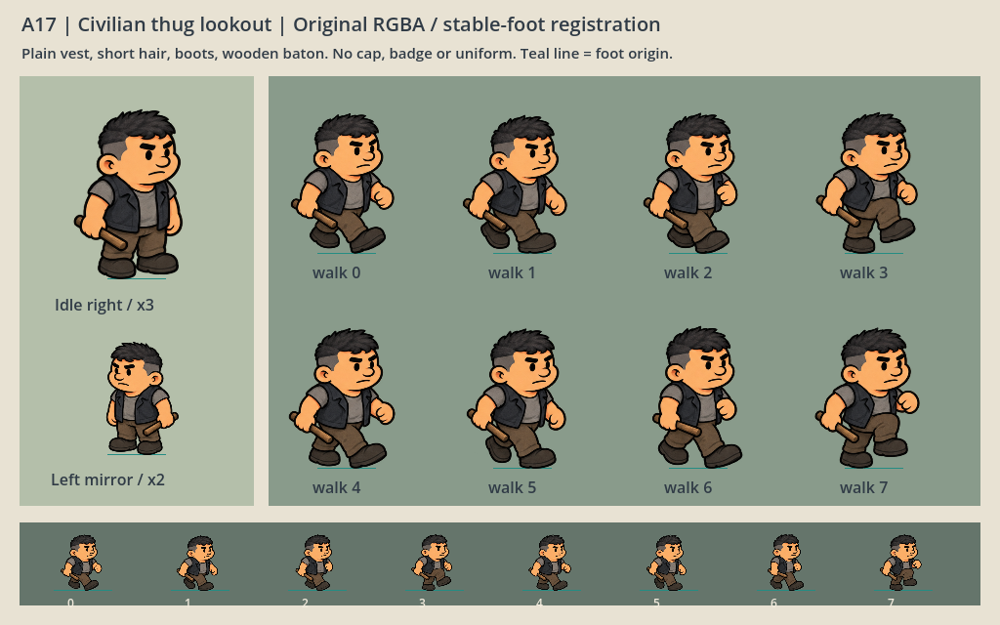

# A17 · 小混混看守站立与八帧行走

2026-10-06，主美。任务 `a17-thug-lookout-20261006`，制作人验收。用户将设定更正为无辜的人被抓进黑工厂强迫劳动，本资产替换警服表现，逻辑兼容ID继续使用 `guard`。



角色为短发、暗灰便服背心、灰T恤、旧棕工作裤、黑工作靴与短木棍；无警服、警帽、徽章、肩章或制式武器。画风仍为 `art-v03 / FINAL-WARM-01` 手绘漫画比例，没有改友方人物或确认新视觉基线。

## 接入

入口 `E:/Project/Godot/这次怎么逃/art/characters/thug_v17/manifest.json` 为顶层完整ActorVisual定义，包含actor_id、texture、frames、anchor、initial_walk_frame_seconds、world_height与walk_animation；无需再从旧警卫定义补idle。

- 唯一原图 `thug_idle_walk8_v17.png`，1254×1254 RGBA，3×3排列。第一格idle，后八格按行优先walk0–7。
- `world_height=60`，`walk_animation.fps=12`，8帧循环约0.667秒。
- 所有walk使用同一个 `scale_height=385`，比例60/385≈0.155844，不能再按每帧裁区高度分别缩放。
- frames含idle/walk_a/walk_b，对应站立与两个真实走路姿势；walk_animation提供八个独立region/anchor，全部复用同一原PNG。
- anchor是裁区局部坐标，头部轴线对应脚底共同原点；左右朝向由ActorVisual围绕脚原点翻转。木棍属于角色图像，未添加攻击规则。
- shadow_baked=false，无地板或烘焙接触阴影；环境阴影仍由现有表现层决定。

帧区域与锚点以manifest为唯一接口源。实际walking彩色主体高度约57.04–58.60世界单位，透明余边计入名义60，八帧自然绘制差约1.56单位；脚底注册一致，没有逐帧拉伸身体修正。门岗/增援的复用及游戏配置切换由制作人P48处理，本次没有修改程序或旧警卫资源。

## 生成与QA

内置 `image_gen.imagegen` 单次生成一张完整角色atlas，`transparent_background=true`。完整准确prompt、参考路径和生成源路径见 `a17-imagegen-source.json`。源PNG逐字节复制，未Python绘画、缩放、扭曲、拼接idle来伪造姿势；Python只读alpha并输出帧裁框/注册元数据。

源SHA256 `4031e6f0a72694b06d106e661fe27d4d4691942e973babaf6b332c6122d5f72d`。站立和八个步态源像素独立；腿迈步、提膝、重心变化及空手摆动均可辨认，持棍手保留较小动作。实际view_image已查看原atlas与Godot原生联系表，暗衣在灰绿场景色上可读，无可见底雾。

`a17-register-thug.py`读图校验结果见 `a17-resource-qa.json`：RGBA、alpha0比例0.6223、9个独立姿势像素哈希、裁框不漏主体/不混邻格、锚点在裁区内、交付图匹配生成源，passed=true。

原生资源QA：Godot4.7.2 Windows D3D12，`a17-native-resource-qa.gd`独立SceneTree生成 `a17-native-contact.png`（1024×640），验证原atlas、八帧裁区、共同缩放和锚点；图中包含放大步态、左翻转及60世界单位一排，已实际查看。该独立运行约2秒并已退出，未启动main场景，未与制作人接入测试持续并发。

```powershell
& 'E:/Godot/4.7/Godot_v4.7.2-stable_win64_console.exe' --path 'E:/Project/Godot/这次怎么逃' --script 'E:/Project/Godot/这次怎么逃/docs/art/a17-native-resource-qa.gd'
```

此次QA确认资源形象、透明、裁框、脚点与原生缩小/翻转表现。完整游戏连续动画、暂停、巡逻/门岗/增援和两尺寸输入验收由制作人P48另行完成，不能将资源联系表写为游戏整体通过。主美未改生产代码、地图、配置、旧PNG，未提交Git或整工程同步。

## 工作流及文件

本人主美凭证通过CLI `status/tasks show/feedback submit`接手，进行中反馈 `a17-thug-art-start-20261006`已收到；交付再单独提交待验收，由制作人审核，未自行验收。

2026-10-06待验收请求 `a17-thug-art-ready-20261006` 初次因“编辑器有未完成操作或未保存内容，请完成后重试”被拒绝，operations show返回not_found。用户确认编辑已保存后，主美使用本人凭证重试完全相同请求，未更改参数/requestId；现已真实收到，status=succeeded，state=pending，待制作人审核。

成功回执：`docs/art/a17-thug-ready-receipt.json`；feedbackId `a17-thug-art-ready-20261006`，evidenceVersion `1`，taskRevision `fb02cb5d623ec082cd238e0750ad1739b97e3ad702cc5288236f35420635e3a8`，接收时间2026-10-06T06:07:41.590Z。没有自行验收或将pending写成accepted。

制作人另报告P49接入原生1200的27项通过，主巡逻/门岗/实际查寝缺员增援复用小混混、八帧/12fps/左右翻转/暂停/四地图/重开已有证据，960复核仍由制作人完成。此为制作人整体测试进展，不替换主美资源QA或冒充主美本人运行。

- `art/characters/thug_v17/thug_idle_walk8_v17.png`
- `art/characters/thug_v17/manifest.json`
- `docs/art/a17-thug-lookout.md`
- `docs/art/a17-imagegen-source.json`
- `docs/art/a17-register-thug.py`
- `docs/art/a17-resource-qa.json`
- `docs/art/a17-native-resource-qa.gd`
- `docs/art/a17-native-contact.png`
- `docs/art/a17-thug-start-feedback.json`、`a17-thug-ready-feedback.json`（CLI请求草稿，不含私钥）
- `docs/art/a17-thug-ready-receipt.json`（真实待验收成功回执）
