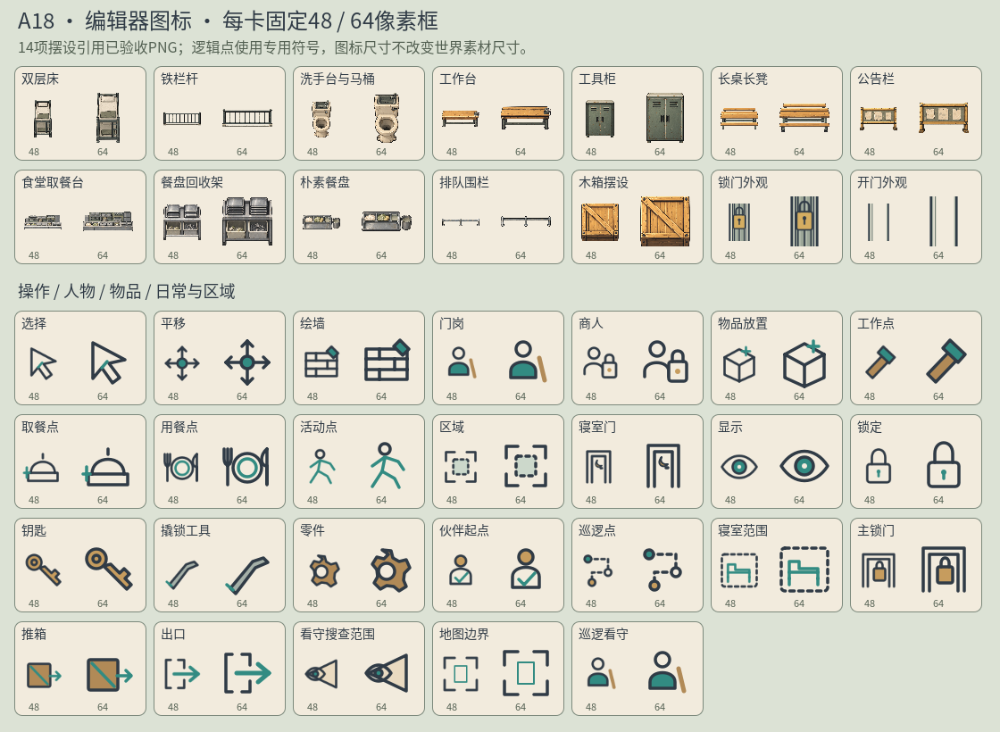

# A18 · 编辑器图标与配套交付规范

2026-10-06，主美。真实任务 `a18-editor-icons-20261006`，制作人验收。主美只新增 `art/editor/v01/*`、本轮a18文档及 `docs/art/editor-icon-standard.md`；程序P51由制作人负责，未改原世界manifest/PNG、生产代码或project.godot，未提交Git。



入口：`E:/Project/Godot/这次怎么逃/art/editor/v01/manifest.json`，schema1；14项assets提供id/name/category/editor_icon，26项tools提供id/name/icon。

14项摆设严格对应现有世界ID：7个prison_v08、4个cafeteria_v14、旧木箱/锁门外观/开门外观。独立AtlasTexture .tres引用原PNG，真实source裁区与正方形margin均记录在 `a18-icon-sources.json`，filter_clip=true。餐盘移除世界摆放所用透明余深，门外观取锁闩/空门局部，避免48px只剩极细长线；这只改变编辑器裁区，不改变地图脚印或世界显示。

工具覆盖门岗、商人、物品、工作/取餐/用餐/活动点、区域、寝室门；另有选择/平移/绘墙、eye/lock、钥匙/撬锁工具/零件、伙伴起点/巡逻看守/巡逻路径/寝室范围/主锁门/推箱/出口/看守范围/地图边界。25个原生SVG供26个工具引用，巡逻看守与门岗共用同一角色符号，通过中文名和组键区别；没有警帽或徽章符号。

符号沿用深墨线、青绿与少量赭黄，透明64画布；背景来自编辑器奶油纸卡。Atlas/SVG本轮是代码原生资源定义，没有imagegen新位图、没有重画已验收PNG。所有资源位于 `art/editor/v01/icons/`，源SVG可编辑。

## 原生资源QA

Godot4.7.2 Windows D3D12，实际ResourceLoader加载40条清单Texture2D引用，检查ID/必需工具/类别/正方形框/图像可取与透明SubViewport四角；最终 `a18-resource-qa.json` 178项通过，failed为空。headless editor资源导入已完成，再完成独立native联系表并退出；不启动main场景。首次透明采样因get_image只取源crop将门局部贴边误报，已改为64透明SubViewport实际渲染后检查；辅助脚本一处SubViewport属性名已修正，最终结果无错误。这些修复没有改素材或程序。

原生 `a18-icon-contact.png`（1120×820）已view_image实际查看：床、栏杆、卫浴、台/柜、长凳、公告栏与四个食堂模块、木箱及门局部在48/64框保留可识别形状，逻辑点符号相互有明显区别。细长排队栏与整段取餐台保留整体轮廓，细节依靠中文名补充，不放内部ID。14个引用PNG在原生运行后再次核验哈希全部与创建前一致。

QA复现：

```powershell
& 'E:/Godot/4.7/Godot_v4.7.2-stable_win64_console.exe' --path 'E:/Project/Godot/这次怎么逃' --script 'E:/Project/Godot/这次怎么逃/docs/art/a18-native-icon-qa.gd'
```

`a18-build-editor-icons.py`可重建本轮独立Atlas/SVG/manifest，仅只读原PNG并生成资源代码。`a18-icon-sources.json`记录原manifest、texture、源SHA、图标crop、虚拟square margin及事后哈希验证。引擎导入生成.import由Godot维护；本轮没有手动改配置或旧素材。

## 长期规范与验收边界

规范 `docs/art/editor-icon-standard.md`已明确后续每项新摆设/角色/交互物必须同时提供editor_icon、稳定世界ID映射、中文分类/名称、透明固定框、来源及48/64加载/审图证据；逻辑标记专用符号，开/锁门外观仅摆设，主规则门独立。制作人会把制作方案写入GameCreator正式art-assets，主美不重复修改正式模块。

资源QA与编辑器程序集成分开。制作人已告知P51 headless61项严格resource_path等于声明路径并通过，后续主界面1280/960原生和真实主屏由制作人顺序完成；该进展不是主美本人运行证据。主美提交待验收，不自行验收，不把联系表当作全部编辑器功能通过。

交付：manifest、14个AtlasTexture、25个SVG及引擎导入信息、来源表、178项报告、原生联系表/QA脚本、重建资源脚本、本说明及长期规范；全部可从上述入口追溯。

本人主美凭证CLI待验收已成功收到：feedbackId `a18-editor-icons-ready-20261006`，evidenceVersion `1`，taskRevision `8df9d323e094b3a6d57d8724af58bf92560f5cd3c50f09b9bac5494a6681373c`，state=pending。真实回执 `a18-ready-receipt.json`，尚待制作人审核，未自行验收。
