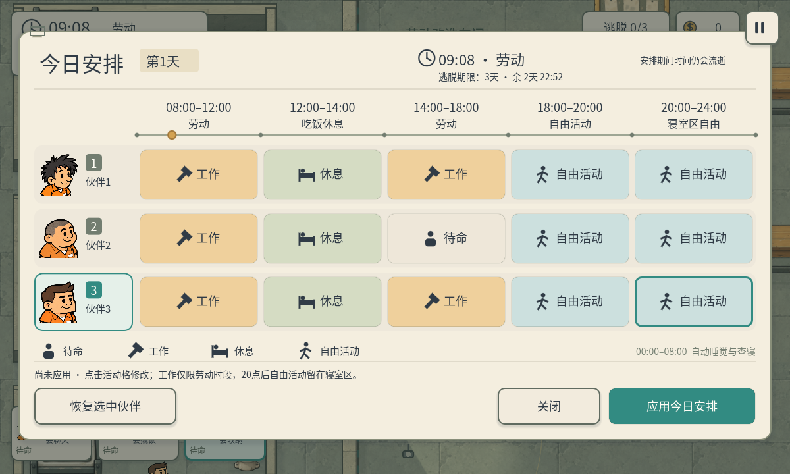
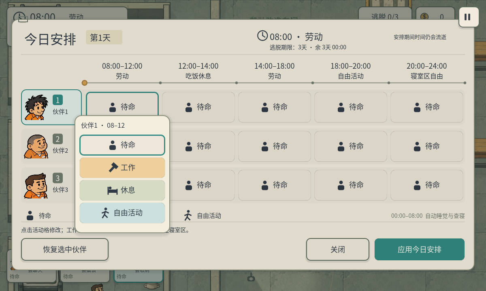
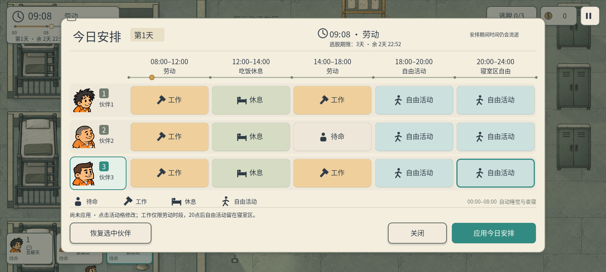

# P37 · A11 日常表概念落地

2026-10-05，制作人程序集成任务 `97cb6b0e-1980-457d-bef2-7d51486748d8`。用户认可 A11 概念并明确要求按图执行。复用 A10 Theme、字体与三个原角色 AtlasTexture，不生成或替换人物素材，不改变 FINAL-WARM-01 世界风格。

## 实现与操作

日常表改为宽幅暖纸排班板：三名伙伴各一行，五时段从左到右共用标题与时间轴。活动显示独立图标、短文字与柔和颜色，工作赭黄、休息灰绿、自由活动淡青、待命纸白；选中人物和活动用青绿描边。当前时间、天数、逃脱期限及实际剩余时间同步显示。底部图例是说明，不是活动刷工具。

点击活动格展开四项轻菜单；点击菜单外侧或 Esc 收起菜单。再次 Esc 关闭日常表。点击头像或活动格会选择对应伙伴，选择本身不接管日常行动。编辑只修改草稿，`应用今日安排` 才提交；`关闭` 放弃未提交修改。`恢复选中伙伴` 沿用原逻辑恢复该人的当前安排。

表与菜单都截获世界输入，活动选择菜单钳制在面板内且避开底部三个主按钮。打开表时继续推进时钟、人物、巡逻，与交易、日程说明、开发设置及暂停菜单互斥。

08–12 / 14–18 才能选择工作，没有岗位的旧关卡也禁用工作；12–14 吃饭休息，18–20 自由活动，20–24 寝室区自由。00–08 自动睡觉与查寝只作为注释，不新增第六编辑栏或改变午夜的玩家操作规则。过去时段、已逃脱人物和午夜禁用编辑。由于面板是活跃的，时段结束时会关闭该段菜单并还原其未提交草稿，避免追溯修改过去的安排；新日08点清除旧草稿并同步标题。

程序代码：`scripts/ui/routine_panel.gd` 管理草稿、输入和菜单，`scripts/ui/routine_board.gd` 绘制身份、图标、时段和时间点，`scripts/ui/fullscreen_hud.gd` 提供安全区布局及 Esc 层级。没有修改 DailyRoutine、寻路、警卫、警犬、物品、地图或项目配置。

## 实际运行画面







三个当前原头像已接入，第三位保留棕侧分发型；A11 静图帽形偏差没有带入正式界面。样例安排仅用于展示和验证，不是默认推荐或必胜策略；开局仍全部待命。

## 布局与验证

面板宽度随安全区变化，最大1280，常规高度622；矮安全区使用紧凑行距。活动格、菜单及身份选择都至少48逻辑单位高，主按钮56高。实装是原生控件与矢量装饰，不把整张概念PNG当交互画面，也不简单缩放PNG生成按钮。

Godot 4.7.2，Windows 原生 D3D12，屏幕触摸事件跨真实渲染帧点击：

| 检查 | 数量 | 结果 |
| --- | ---: | --- |
| `p37_native_ui.gd`，1200×720窗口 | 49 | 全通过 |
| 同脚本，1600×720窗口 | 49 | 全通过 |
| 同脚本，960×540窗口 | 49 | 全通过 |
| 原P36日常行为回归 `p37_daily_routine.gd` | 30 | 全通过 |
| 原交易/物品/暂停UI回归 `p37_ui_regression.gd` | 46 | 全通过 |
| 原多天/查寝回归 `p37_multiday_regression.gd` | 36 | 全通过 |

本轮共259项检查。UI检查包含三人赴岗、零抓回、菜单四选项、禁用项无效、草稿提交/取消、头像选择、恢复操作、外侧点击不漏到世界、Esc先关菜单、过期菜单与草稿、新日清表、午夜只读、已逃脱行、旧图工作禁用、安全区与紧凑布局。实际查看1200/1600/960的排班板截图及1200活动菜单。回归脚本保留原测试行为，报告使用独立 `p37-*` 路径。

960×540窗口的逻辑画布是1280×720，受现有canvas_items/expand设置影响；不能把逻辑热区直接当作手机物理像素。额外检查920×504逻辑安全区的紧凑布局、按钮大小与标题间距。没有手机真机、拇指遮挡或真人规划可用性测试。

开发中修正一个绘制变量类型推断错误、未初始化样式缓存元数据读取、旧Esc处理在活动菜单打开时关闭整表的问题；最终测试进程无脚本错误。旧核心逻辑无需迁就UI改变。

用户既有 `project.godot` 差异保持原样，SHA256：`C92BE6253B1D9417C3DD019A12ABF986C1D992808EB9313E5D0B14AC87682B7E`。既有 `qa/p34_dorm_boundary.gd.uid` 未纳入本轮。

## 复现

```powershell
& 'E:/Godot/4.7/Godot_v4.7.2-stable_win64_console.exe' --path . --resolution 1200x720 --script qa/p37_native_ui.gd -- 1200
& 'E:/Godot/4.7/Godot_v4.7.2-stable_win64_console.exe' --headless --path . --script qa/p37_daily_routine.gd
& 'E:/Godot/4.7/Godot_v4.7.2-stable_win64_console.exe' --path . --resolution 1200x720 --script qa/p37_ui_regression.gd -- 1200
& 'E:/Godot/4.7/Godot_v4.7.2-stable_win64_console.exe' --headless --path . --script qa/p37_multiday_regression.gd
```

UI另两尺寸把resolution与末尾标签替换为1600x720/1600、960x540/960。结果 `docs/tests/p37-native-*.json`、`p37-routine-logic.json`、`p37-regression-1200.json`、`p37-multiday-headless.json`。常规游戏仍从 `res://scenes/main.tscn` 启动。
