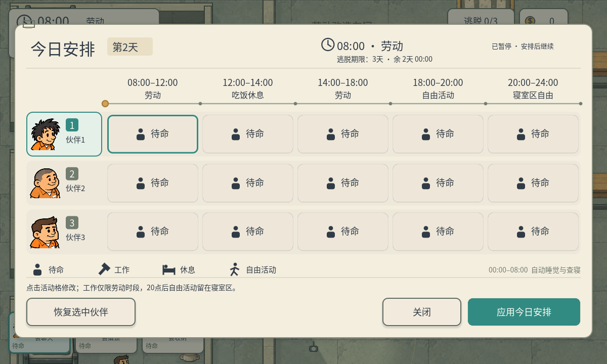
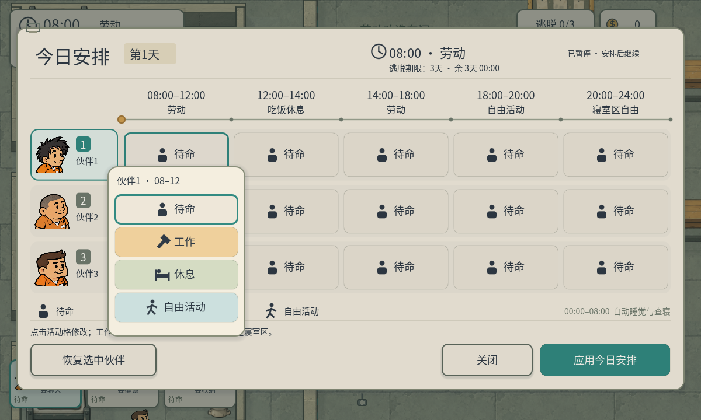

# P38 · 暂停日常表与晨间分配

2026-10-05，制作人程序任务 `e0089bd5-a2e9-45aa-a786-b9efdd661393`。用户明确要求当前人员日常表打开时暂停、暂停按钮层级低于表、每天早晨自动打开让玩家安排。本规则覆盖 A11/P36/P37 关于人员日常表活跃计时及不强制弹窗的旧约定；历史概念与验收文件保留。

## 当前行为

- 开局、重开、切换关卡均从第1天08:00自动打开空白日常表。
- 每个新安排日08:00自动打开一次。自然过晨和跳过夜晚都适用；当天关闭后不会再次自动打开。午夜不自动弹，最终逃脱期限优先结算。
- 打开人员日常表暂停整个SceneTree世界：时钟、游戏累计时间、行动、技能、警卫、警犬、动画与声音遵循暂停状态。表、活动菜单、关闭与应用按钮仍能接收触摸。右上提示改为“已暂停 · 安排后继续”。
- 应用、关闭、恢复安排或Esc关闭日常表后继续；活动菜单打开时Esc先收起菜单。关闭保留其他既有暂停占用，转入常规暂停菜单不会错误解暂停。
- 全局暂停入口在人员表打开时降低到表下并收起，无法越过表的控件树拦截点击；表关闭后恢复。小地图在冻结前显式隐藏，避免其普通可暂停可见性更新停在旧状态。

当天默认全部待命；所有工作时段、午夜锁寝、物品交易、路线与技能规则继续使用既有系统。作为另一个界面的“作息说明”和交易仍按原规则计时，人员排班表是此次暂停目标；相关说明明确区分这两个界面。

## 实现

RoutinePanel以显式open/close管理自己的暂停占用，记录打开前状态，面板与遮罩使用Always处理模式。FullscreenHUD负责暂停入口层级与菜单交接，保留表的暂停状态。DailyRoutine用morning_pending保存尚未提供的晨间分配请求；UI初次构建完成再消费，每个新日只消费一次。

PrisonSchedule在真实时间推进时钳制到下一次08:00边界；高流速同样精确到08:00。核心当前帧在日常表打开后立即返回，不继续更新行动和敌人；累计游戏时间只计入真正推进到晨间的部分。期限终点不会提供日常分配。跳夜使用同一日常逻辑，无额外重复标记或新日期枚举。

只改五个既有程序文件：routine_panel、fullscreen_hud、daily_routine、prison_schedule、escape_game。没有新美术或玩法系统，用户流速/天数偏好不变。project.godot的既有差异保持，SHA256 `C92BE6253B1D9417C3DD019A12ABF986C1D992808EB9313E5D0B14AC87682B7E`。

## 真实画面





实际查看1200晨间板、1600晨间板与960排班板，确认暂停入口不覆盖、暂停文案及五时段可读。原生截图等待两次渲染帧，使程序设置后的文字排版也进入D3D12帧缓冲；单帧截图曾保留旧期限文字，不能把旧帧当作最新显示证据。

## 检查与限制

Windows Godot4.7.2 / D3D12，跨真实帧ScreenTouch操作，不直接发按钮信号：

| 报告 | 检查数 | 结果 |
| --- | ---: | --- |
| p38-native-1200.json | 74 | 全通过 |
| p38-native-1600.json | 74 | 全通过 |
| p38-native-960.json | 74 | 全通过 |
| p38-routine-logic.json | 30 | 全通过 |
| p38-regression-1200.json | 46 | 全通过 |
| p38-multiday-headless.json | 36 | 全通过 |

共334项。新增关键证据：暂停中的真实20帧时钟/人物/警卫/警犬快照不变，触摸修改草稿成功，关闭后真实时钟恢复；被覆盖暂停入口不能截获输入；应用/恢复继续；16倍流速自然停在第2天08:00且同帧不移动；午夜不弹、跳夜第3天弹、每天仅一次、重开菜单暂停交接、原暂停保留、期限结算不弹。仍检查三人正常赴岗、零合法工作抓回、交易/背包/暂停、查寝真实巡视与四图兼容。

既有回归场景明确先关闭晨间分配再执行各自非分配测试；更改后的换图与结算重开断言改为自动弹表暂停，未跳过失败断言。旧测试与报告不覆盖。首次检查发现小地图可见状态在冻结时来不及更新，已修正；一次Windows初始焦点交接影响早期触摸，测试增加初始化帧及有限焦点等待，最终三尺寸全部通过。

960×540窗口的逻辑画布仍是1280×720，由原canvas_items/expand设置决定。保留920×504逻辑安全区检查。没有Android/iOS真机或真人易用性验证。直接设时钟的既有只读/过期测试是明确fixture，不代表暂停中自然流逝。

## 复现

```powershell
& 'E:/Godot/4.7/Godot_v4.7.2-stable_win64_console.exe' --path . --resolution 1200x720 --script qa/p38_native_ui.gd -- 1200
& 'E:/Godot/4.7/Godot_v4.7.2-stable_win64_console.exe' --headless --path . --script qa/p38_daily_routine.gd
& 'E:/Godot/4.7/Godot_v4.7.2-stable_win64_console.exe' --path . --resolution 1200x720 --script qa/p38_ui_regression.gd -- 1200
& 'E:/Godot/4.7/Godot_v4.7.2-stable_win64_console.exe' --headless --path . --script qa/p38_multiday_regression.gd
```

另两原生尺寸替换为1600x720/1600、960x540/960；测试原生窗口按顺序执行，避免争夺焦点。主入口仍是res://scenes/main.tscn，启动即看到第1天08:00暂停的人员日常表。
