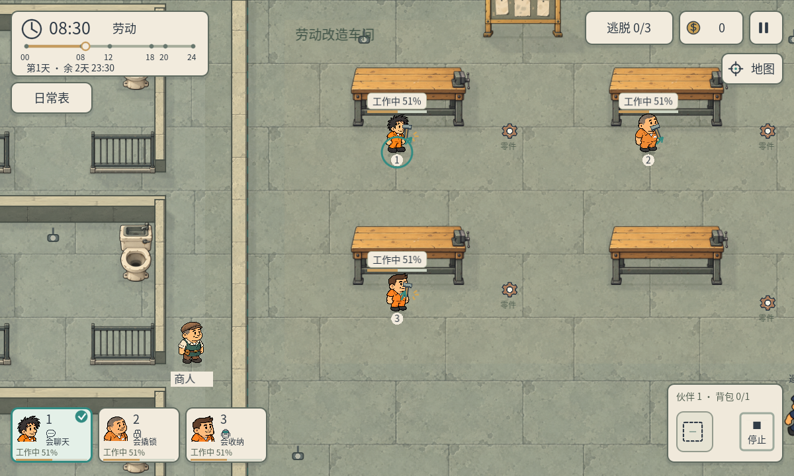
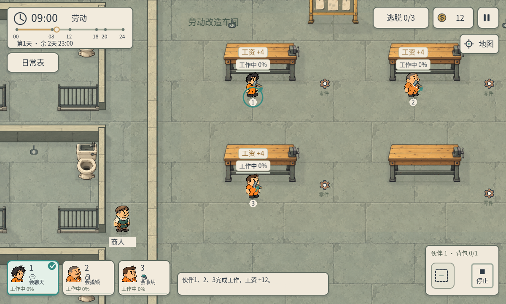
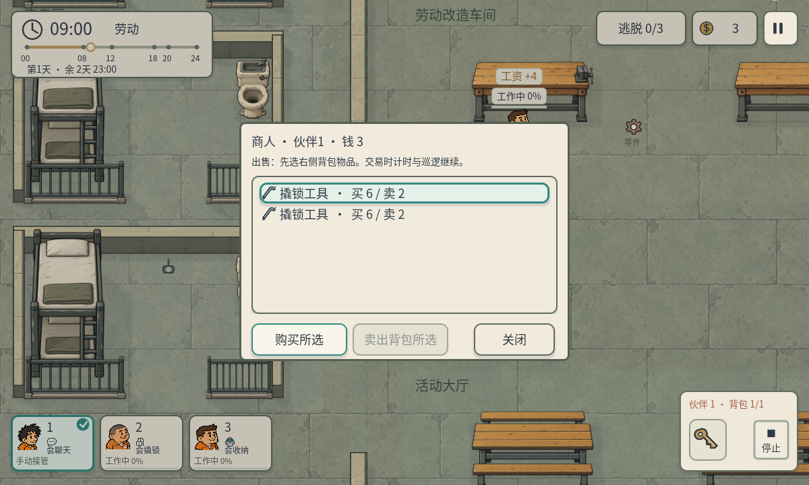

# P39 · 工作表现与完成工资

2026-10-05，制作人程序任务 `2cbd32b4-bc7c-4d6e-84d2-472b74d9d0b2`。对应用户要求：工作时应有可见表现，工作完成后发放金钱。

## 玩法规则

在R04日常表的08:00–12:00或14:00–18:00安排工作，伙伴独立寻路到自己的工作台。只有实际到岗、未被手动接管且没有正在执行技能的伙伴累计有效劳动时间。每累计60个游戏分钟完成一轮，每人获得4元，自动进入已有的共享钱包，不占背包格，可以向商人买物品。

工作时有持续敲打的小锤、身体轻微倾斜、击打短线；头顶显示“工作中 N%”和进度条，左下人物卡也同步显示进度。完成时各人头顶显示“工资 +4”，正下方提示本次合计工资，右上钱包立即更新，随后开始下一轮。

走路、路线受阻、手动离岗、技能操作、睡觉和非劳动时段不累计。暂停日常表或暂停游戏冻结进度与动作；时间流速为0时劳动进度停止。未完成的一轮在离岗、午休和跨天后保留，回到岗位继续；重开或切换关卡清空本局累计。没有工作岗位的R01–R03不会产生工资。

目前采用每轮即时支付，没有劳动时段末的部分工资。日常表底部说明本轮耗时、工资和进度保留规则。`data/rooms/r04.json`的`work_pay.minutes_per_round`和`work_pay.wage`可调整节奏；本次没有新增疲劳、生产物品或新的美术资源。

## 实现与边界

DailyRoutine管理每人的有效分钟、完成轮数、累计收入、短期到账提示。EscapeGame在推进时钟前取得已到岗人员，在替换日程状态前结算这一段劳动，按12:00/18:00边界裁切，避免午休或自由活动继续产钱。单调的已记账时钟保证同一个区间最多消费一次，多轮结算保留余量，重复恢复安排不会重复付钱。

ActorVisual只在原人物脚点上叠加绘制动作和工具，未修改人物位置、寻路、摄像机、墙壁、精灵图或行走动画。FullscreenHUD复用现有钱包和人物卡；Trade/Inventory沿用既有货币与买卖逻辑，没有第二套金钱。

## 画面







已查看上述工作、到账画面及960窗口日常表，确认标签、人物卡和工资说明可读。工作截图的收起小地图仅为展示三个岗位，不改变玩家默认设置。

## 验证

Windows Godot4.7.2 / D3D12原生触摸测试和无界面逻辑测试，共388个断言通过。

| 报告 | 数量 | 内容 |
| --- | ---: | --- |
| p39-work-pay.json | 31 | 实际赴岗、独立进度、暂停、流速0、手动接管、重返岗位、重复区间、跨轮余量、午休边界、跨天与重开、受阻/技能/捕获/终局、不支持工作地图，以及赚取的钱购买钥匙 |
| p39-work-native.json | 23 | 真实ScreenTouch安排三人工作、实际赴岗、动态敲打、脚点保持、工资与HUD、暂停冻结、实际触摸商人购买 |
| p39-native-1200.json | 74 | 1200×720窗口日常表、晨间弹出、暂停与输入层级 |
| p39-native-960.json | 74 | 960×540窗口同项检查及排版 |
| p39-native-1600.json | 74 | 1600×900窗口同项检查及排版 |
| p39-routine-logic.json | 30 | 三人独立赴岗、合法工作、警卫与警犬、各时段安排 |
| p39-multiday-headless.json | 36 | 午夜锁门、查寝路径、跳夜、天数与逃脱期限 |
| p39-regression-1200.json | 46 | 原生背包、交易、暂停、菜单、日程说明、四张地图与重开 |

工资测试使用实际推进的时钟与三人寻路，不预设钱包。交易测试只用商人旁位置作为独立fixture，付款是之前实际赚取的工资。新原生测试的早期版本曾使用错误的测试控件属性和商人数组坐标类型，修正测试后最终所有断言通过，运行无脚本错误。未声称Android/iOS真机测试或真人游玩验证。

保留用户已有`project.godot`差异，SHA256仍为`C92BE6253B1D9417C3DD019A12ABF986C1D992808EB9313E5D0B14AC87682B7E`，原流速偏好4与三天期限不变。P38历史证据保留，回归报告另存P39。

## 复现

在项目目录分别运行：

```powershell
& 'E:/Godot/4.7/Godot_v4.7.2-stable_win64_console.exe' --headless --path . --script qa/p39_work_pay.gd
& 'E:/Godot/4.7/Godot_v4.7.2-stable_win64_console.exe' --path . --script qa/p39_work_native.gd
& 'E:/Godot/4.7/Godot_v4.7.2-stable_win64_console.exe' --path . --resolution 1200x720 --script qa/p39_native_ui.gd -- 1200
& 'E:/Godot/4.7/Godot_v4.7.2-stable_win64_console.exe' --headless --path . --script qa/p39_daily_routine.gd
& 'E:/Godot/4.7/Godot_v4.7.2-stable_win64_console.exe' --headless --path . --script qa/p39_multiday_regression.gd
& 'E:/Godot/4.7/Godot_v4.7.2-stable_win64_console.exe' --path . --resolution 1200x720 --script qa/p39_ui_regression.gd -- 1200
```

主入口仍为`res://scenes/main.tscn`，第1天08:00弹出日常表。选择工作并应用，当人物真正到达岗位后出现劳动表现。
