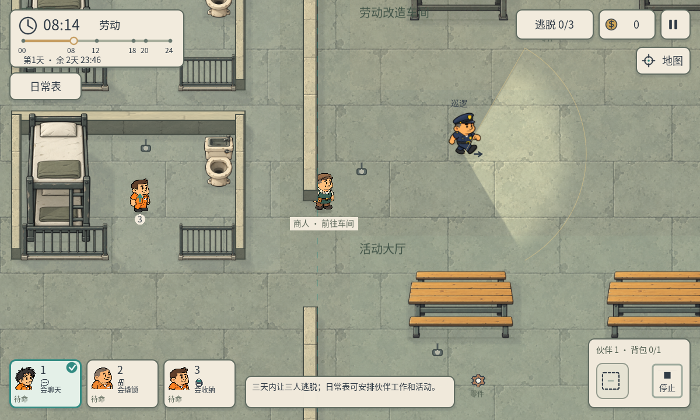
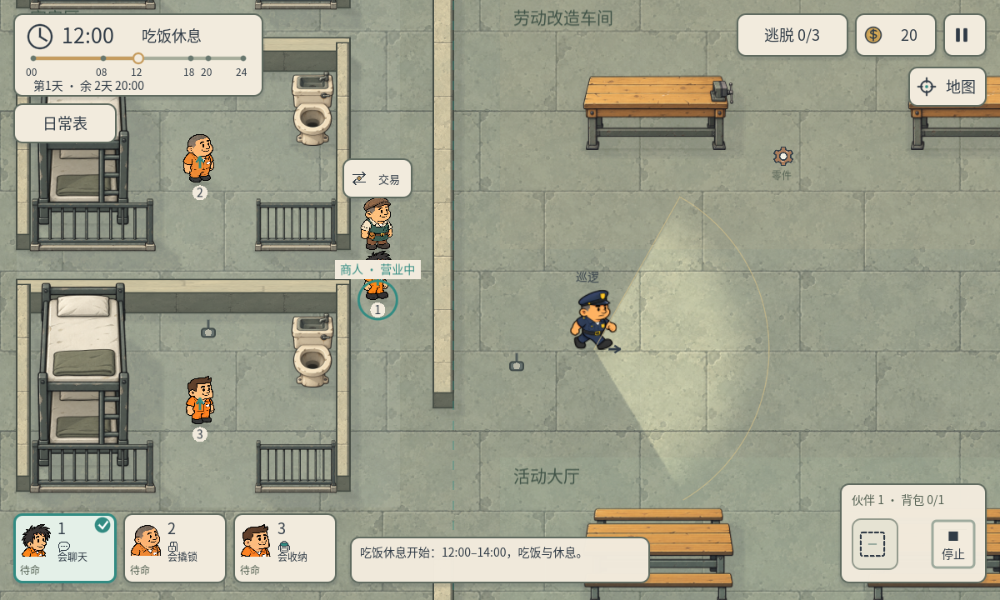
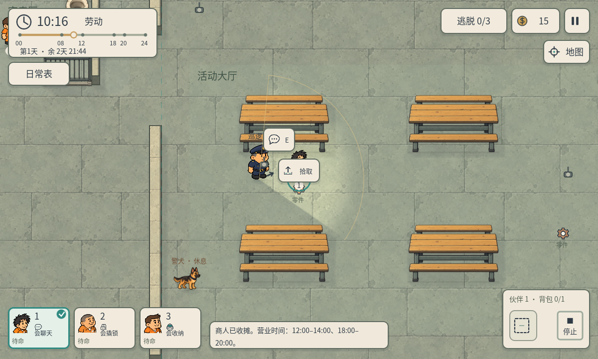
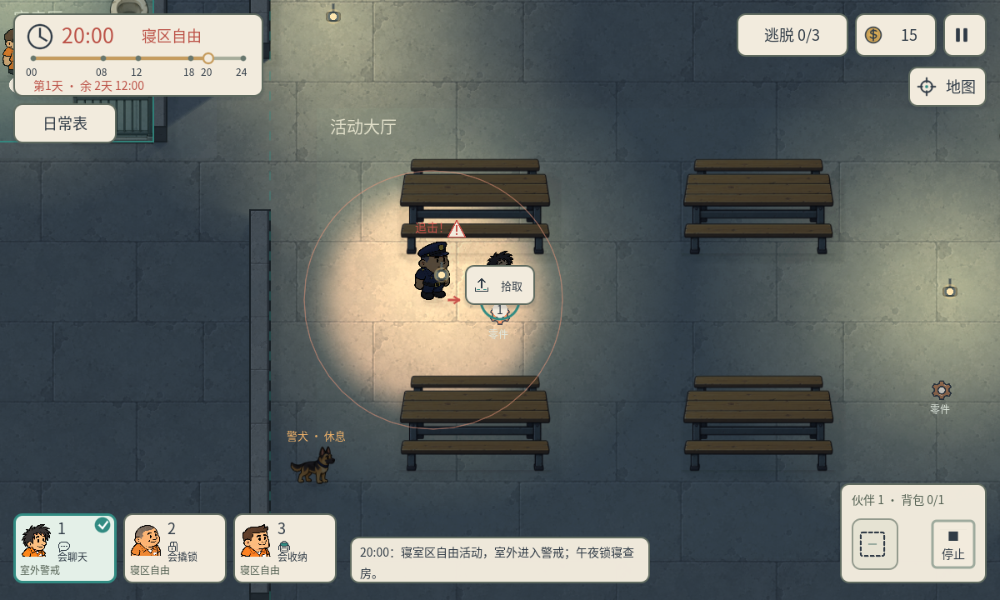

# P40 · 非戒备巡逻与商人日常营业

2026-10-05，制作人程序任务 `3b8c9c9e-0b87-4e51-98fc-2e1967c8d288`。用户要求白天等非戒备时段警卫不抓人，商人不再固定站立，按日常活动和营业时间行动。

## 戒备规则

- 08:00–20:00为非戒备时段。手动控制、正常活动或贴近警卫均不触发追击、调查或抓回；警卫继续原巡逻与照明。
- 20:00–24:00室外戒备，寝室区仍安全；00:00–08:00保留锁寝与进房查寝，床位睡眠继续受到保护。
- 戒备由日程的curfew状态决定，手动改照明为夜晚不使白天抓人。切回非戒备时清除旧追击/调查，抓回入口也再次检查戒备状态。
- 18:00–20:00警犬仍能巡逻，非戒备时不追踪伙伴、不犬吠示警、不引发警卫调查。午夜与戒备时的原嗅探规则保留。

此规则覆盖旧版“白天手动接管会恢复抓捕”的约定。原测试中对应两个断言已在P40副本改为白天不抓/不追踪；P39源码和历史报告保留。

## 商人日常

R03、R04商人每天按下表真实寻路活动，没有按时传送或白天常驻摊位。

| 时段 | 活动 |
| --- | --- |
| 00:00–08:00 | 休息 |
| 08:00–10:00 | 前往车间并工作 |
| 10:00–12:00 | 返回摊位，提前到达后等待营业 |
| 12:00–14:00 | 到岗后营业 |
| 14:00–16:00 | 前往车间并工作 |
| 16:00–18:00 | 返回摊位，提前到达后等待营业 |
| 18:00–20:00 | 到岗后营业 |
| 20:00后 | 收摊，前往休息点 |

人物一直保留可见，走动有轻微身体动作与朝向翻转。标签显示“前往车间”“车间工作”“前往摊位”“待营业”“营业中”“前往休息”“休息中”，路径无法完成会标记受阻。买卖与交易图标同时要求营业时段、到达摊位、伙伴距离100以内且无遮挡。交易弹窗内列出营业时段，14:00/20:00收摊时立即关闭弹窗；延迟购买再次校验，不能扣款或转移物品。

商人移动按时间流速缩放，使通勤的游戏时长在开发者调速后保持一致；玩家移动方式不变。暂停时NPC、动作和日程均冻结，流速0也冻结通勤。通勤提前开始以适配大地图，迟到或被伙伴挡住时尚未营业。重开回初始位置与库存，跨天保留库存、钱包和实际位置，不会传送回摊位。

## 实现

Merchant是独立Node2D状态，Trade拥有商人运行对象，逐帧调用原世界寻路/移动/墙体碰撞，运行位置同步原merchants结构。商人日程是R03/R04数据。ItemsView复用原商人图、显示动态位置与标签。交易金额仍使用原inventory.wallet，工资规则不变；没有新美术资产、生产物品或第二套货币。

## 真实画面与检查

Windows Godot4.7.2/D3D12，共402项断言通过：

| 报告 | 项数 |
| --- | ---: |
| p40-rules.json | 75 |
| p40-native-routines.json | 13 |
| p40-work-pay.json | 31 |
| p40-work-native.json | 23 |
| p40-routine-logic.json | 30 |
| p40-multiday-headless.json | 36 |
| p40-native-1200.json | 74 |
| p40-native-960.json | 74 |
| p40-regression-1200.json | 46 |

核心75项包含白天各时段近距离/残留追击的禁止抓捕、警犬非戒备、照明不授权抓捕、20点抓回、安全区、午夜睡眠与清晨解除。两图商人均完整跑过上午和下午赴岗/通勤，逐帧检查位置及路径不穿墙，验证两次营业、买卖、收摊、暂停、午夜/跨天/重开。

原生13项使用真实通勤至中午以及ScreenTouch开店、购买、选背包、出售，另用明确的人物/警卫位置fixture演示白天接触与夜晚追击。此UI买卖钱包是隔离fixture；P40工资原生23项另以实际赚取12元购买钥匙，余额3元，没有补钱。工资测试的消费时间改到营业时段，商人通过寻路回岗后才交易，未取消交易成功断言。历史午夜查寝路径、晨间暂停分配、背包、买卖及四图回归继续通过。

查看了商人通勤/营业与非戒备截图，角色、日程和互动信息可读。开发初期修复了一处动态类型推断与首次构建时日程为空的访问；初次原生工资交易测试发现商人尚未到岗，调整测试真实等待其返回摊位，不放宽营业条件。最后运行无脚本错误。未声称手机真机或真人测试。

用户`project.godot`差异和偏好保留，SHA256仍为`C92BE6253B1D9417C3DD019A12ABF986C1D992808EB9313E5D0B14AC87682B7E`。小地图真实位置和非戒备交谈提示由配套P40B任务单独集成验收。

复现：使用`Godot_v4.7.2-stable_win64_console.exe --headless --path . --script qa/p40_rules.gd`，原生运行`--path . --script qa/p40_native_routines.gd`。其余对应qa/p40测试脚本，原生窗口依次运行以保持触摸焦点。
