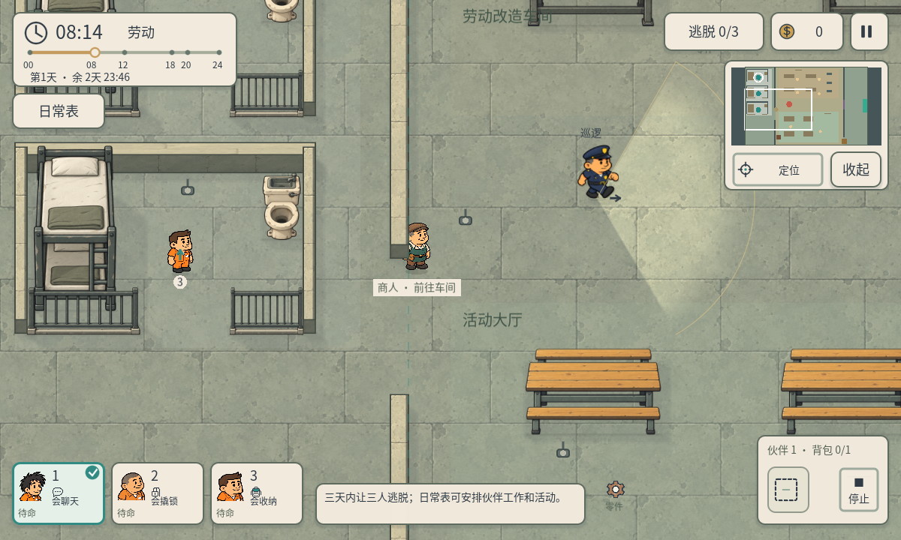
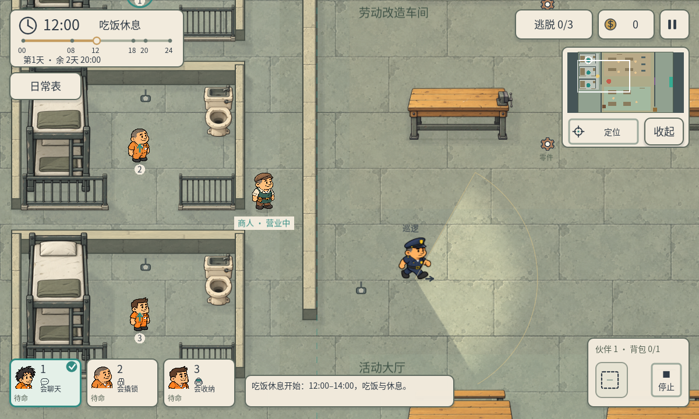

# P40B · 流动商人小地图与非戒备交谈提示

2026-10-05，制作人配套集成任务`97d99b03-19e6-47d5-b8cd-f3a4c025cf40`，在P40核心验证完成后执行。

小地图读取Trade的商人实际运行位置，营业用亮黄色，未营业用暗黄色，夜晚仍可定位休息中的商人。原来的静态起始坐标和宵禁隐藏标记移除。与警卫交谈时，提示改为“当前非戒备，狱警不追捕”，午夜与戒备不接受交谈的限制保持。

修改仅限`mini_map.gd`和`skill_controller.gd`的原显示接口，复用P40位置和营业状态，不增加玩法或美术资源。

原生Windows D3D12测试`qa/p40b_map_chat.gd`的12项检查通过，报告`docs/tests/p40b-map-chat.json`。商人实际从08:00走动到12:00到岗；读取最终帧缓冲，验证当前位置暗黄标记、旧固定位置不再显示、中午亮黄标记、夜晚暗黄标记可见。角色与警卫位置使用明确交谈fixture，确认白天可交谈、正确提示且警卫继续谈话、戒备时不能交谈。P40核心402项报告独立保留，本轮合计414项检查。

未做Android/iOS真机或真人测试。商人本体仍使用现有单帧素材叠加走动动作；未声称新增完整逐帧NPC动画。保留project.godot既有差异与用户时间偏好。
