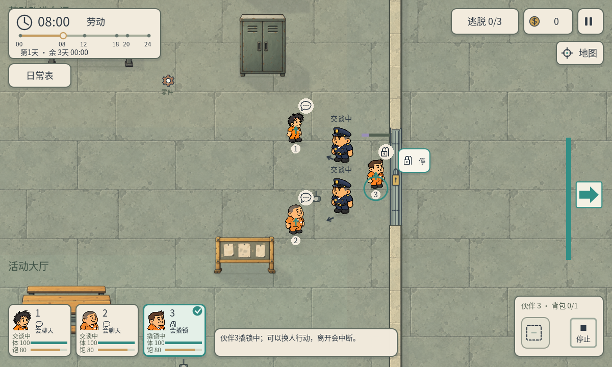
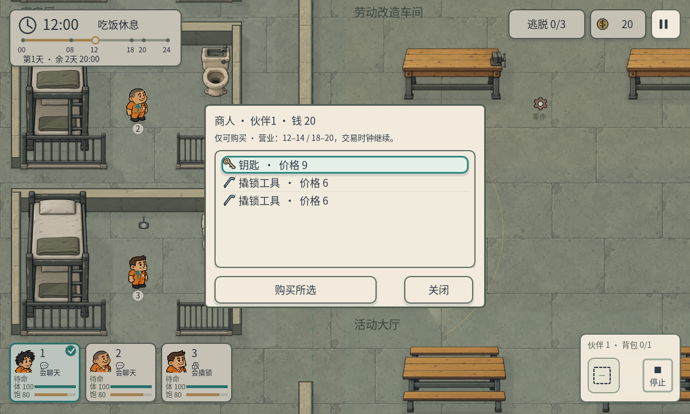
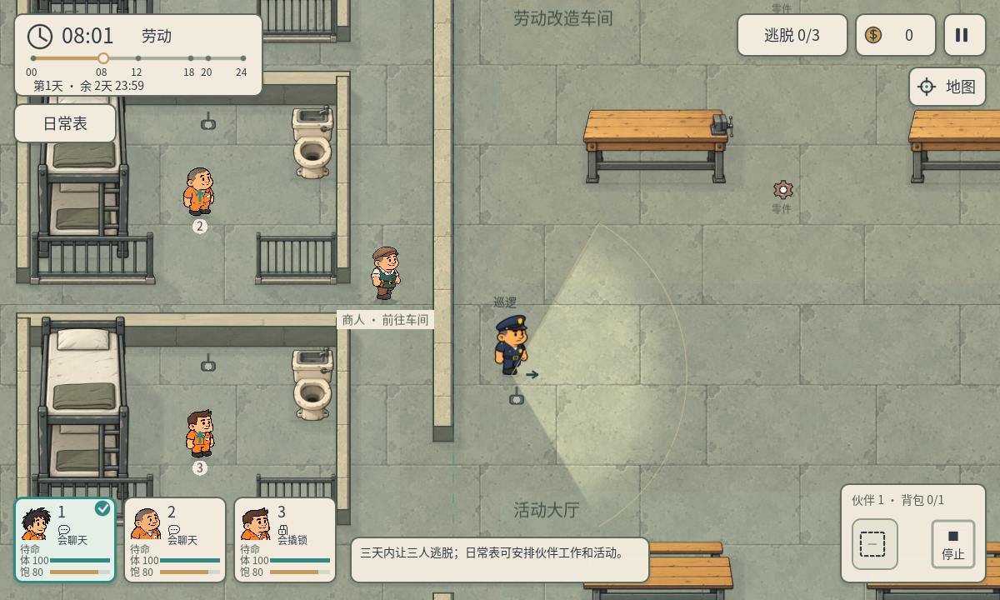

# P41 · 只买入商店、铁门守卫与商人行走

2026-10-05，制作人任务`bd7784c5-20dc-460f-9b73-e9ce1484f519`。用户要求取消玩家出售、商人补行走动画、白天铁门多加守卫，并确认守卫阻止撬锁和通行、聊天分散后可操作；非戒备不抓人保持。体力/饱腹度按另行确认的P42集成，生命值暂不做。

## 当前规则

- 商店只向玩家卖物品。移除出售按钮、卖价与旧的出售引导，购买按钮加宽。旧`try_sell`调用直接拒绝，背包、库存、物品归属和钱包不变。工作工资仍是实际收入，商人营业/到岗条件保持。零件可携带或带出；旧数据中的价格兼容字段保留，运行时不再用于回购，零件旧销售说明也不会显示在背包提示中。
- R03/R04铁门左侧新增两名白天守门警卫，复用原警卫素材，头顶“守门”或“交谈中”，小地图有标记；巡逻警卫和警犬仍独立存在。08:00–20:00值守，非戒备不抓人；20点后离岗，原室外警戒与午夜查寝继续。
- 任一守门警卫仍值守，禁止撬锁、钥匙使用与穿过铁门。分别由两名会聊天的伙伴牵制后，第三人可操作。交谈绑定实际目标警卫，不会在两个目标之间跳变；离开、停止或体力耗尽使相应警卫恢复值守。门的既有锁进度保留。即使门已打开，值守恢复也会重新阻止通过。
- 守门通行控制使用原世界的门口碰撞与寻路屏障，不修改已开门的锁状态，不抓回正常路过的伙伴。暂停不推进人物/对话。午夜查寝、晨间换班、重开/换图会正确清除目标并同步值守。

本局技能仍随机，不保证每局都有两名聊天者。可以选择在夜间守门者离岗后利用钥匙/撬锁和原夜间潜行规则，不增加强制随机修补或新技能。

## 商人动画

主美A12单独交付并由制作人验收，资源入口`art/characters/merchant/walk_v12/manifest.json`。8个独立生成走路姿势，12fps、0.667秒循环，透明背景，64单位显示。ItemsView真实位移时按walk_elapsed选择帧，使用统一scale_height和各帧脚点anchor；停止回原idle，左向围绕脚点镜像，暂停冻结。旧idle与原角色PNG不改，新步态不叠加旧bob，也不按每帧裁框高度重算身高。资源缺失时保留原idle。

完整A12联系表、来源与生成提示词见`docs/art/a12-merchant-walk.md`，主美Godot资源38项/原生40项检查通过；制作人另查看64单位联系表与完整游戏画面。

## 验证

本次程序与P42联合检查372项全部通过：

| 报告 | 项数 |
| --- | ---: |
| p41-rules.json | 20 |
| p41-native-features.json | 16 |
| p41-work-native.json | 23 |
| p41-work-pay.json | 31 |
| p41-routine-logic.json | 30 |
| p41-multiday-headless.json | 36 |
| p41-regression-1200.json | 46 |
| p41-native-1200.json | 74 |
| p41-native-960.json | 74 |
| p42-attributes.json | 22 |

原生ScreenTouch实际完成选人、两个不同警卫的聊天、撬锁、真实位移通过门口；两人持续交谈时锁进度增长且无人被抓。另检查一名仍值守、钥匙不误消耗、聊天终止后已开门仍不能通过、夜间离岗、四图切换/重开及出售拒绝不丢财物。商人真实行走中8个帧都实际出现，停走/暂停与购买可用。原生属性条、只买入界面、日常表在1200与960窗口中可读。

收入测试依旧实际赴岗后赚12元购买9元钥匙，不预设工资钱包。隔离守卫/背包UI用明确初始位置和购买余额fixture；这些不是完整随机局通关证明。P40买卖回归副本按用户新规则改为出售被拒绝、门口值守时钥匙保留；真实门口放行与解锁由新16项原生配合测试覆盖，没有绕开失败断言。未声称Android/iOS真机或真人易用性验证。

项目保持现有三天期限与时间偏好。`project.godot`已有差异未改，SHA256仍为`C92BE6253B1D9417C3DD019A12ABF986C1D992808EB9313E5D0B14AC87682B7E`。

复现：`Godot_v4.7.2-stable_win64_console.exe --headless --path . --script qa/p41_rules.gd`；原生`--path . --script qa/p41_native_features.gd`；其他P41/P42脚本见qa。原生窗口依次执行以免触摸焦点互抢。
