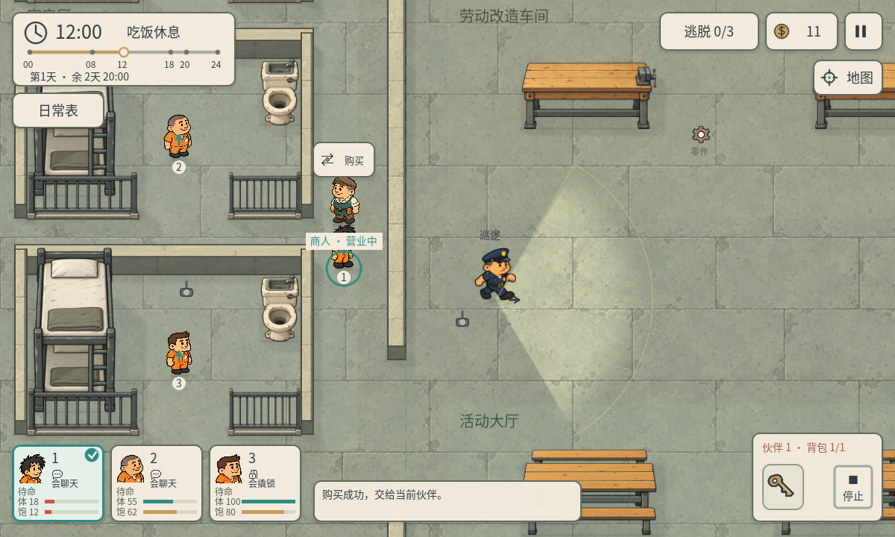

# P42 · 体力与饱腹度

2026-10-05，制作人任务`8f14d139-9187-4918-9112-e8e10bcb0ee2`。用户确认先做体力、饱腹度，连接工作/休息/吃饭，生命值以后再做。

## 属性与行为

三位伙伴独立拥有0–100体力、0–100饱腹度；开局100/80。左下人物卡显示“体/饱”数值和两条色条，低于25变红。卡宽仍最多124，增加到104高以容纳两行，不压住底部提示和背包。工作标签和进度保留。

属性按实际游戏分钟消耗或恢复：

| 行为 | 体力变化/分钟 | 饱腹度变化/分钟 |
| --- | ---: | ---: |
| 一般时间 | 0 | -0.035 |
| 真正到岗工作 | -0.18 | 额外-0.035 |
| 实际走动 | -0.06 | 普通消耗 |
| 撬锁等技能 | -0.15 | 普通消耗 |
| 持续交谈 | -0.04 | 普通消耗 |
| 到自己寝室停止行动、休息 | +0.6 | 普通消耗 |
| 12:00–14:00在自己寝室休息/进食 | +0.6 | 额外+0.8 |
| 实际睡觉 | +0.35 | 普通消耗 |

在日常表安排午休，人物通过原寻路回到寝室后进食；在大厅站着不会隔空获得午饭。未安排活动但已在自己寝室停止行动也能休息。无需新增餐厅位置或食物背包物品即可先验证本轮循环。

体力低于25时移动为80%、劳动/撬锁效率70%；饱腹低于25时移动再乘80%、劳动/撬锁再乘65%。体力耗尽时移动仍有55%，可以回寝室；工作停止、工资进度停止，技能被拒绝/中止，显示“疲惫 · 请休息”。没有饥饿死亡、受伤或生命值。

工资的60分钟改为有效劳动分钟，低属性时一轮需要更长实际劳动，未完成部分保留。到岗以前、暂停、流速0、离岗、无岗位仍不空领工资。体力恢复后重新安排/恢复工作即可继续。

## 记账与持续

ActorAttributes记录单调已结算时钟，以游戏分钟边界积分，允许长帧在体力耗尽处截断。EscapeGame在推进时钟前取实际行为，在日程切换前算属性和有效劳动，再交原DailyRoutine累计工资；同一区间不重复消耗或支付。12/18边界不会把旧工作记录继续算到下一个劳动时段。

SceneTree暂停、时钟0、终局停止结算。跨天保留数值，晨间排班暂停；跳过夜晚按实际跳过的睡眠时长恢复体力、消耗饱腹并消费这段时钟，清晨不再重复恢复。重开/换图回到100/80。参数集中在`data/attributes.json`。

## 检查

`qa/p42_attributes.gd`22项通过：三人实际赴岗、60游戏分钟消耗与三人工资12元、独立属性、暂停/时间0/重复区间、低体力截断和停止工资/技能、饥饿减效率但仍可移动、真正回寝室恢复、午休实际赴寝室后进食、大厅无午饭、跨夜恢复/清晨暂停/终局/重开。低数值阈值与大厅位置是明确fixture。

P41原生配合16项和工资消费23项检查共同验证新属性UI、真实门口配合及工资购买。1200/960两尺寸各74项、背包/商店46项、日常30项、午夜查寝36项与工资31项回归通过；加核心门口/商店20项，本轮程序合计372项。截图中的低值是视觉fixture，不表示实际随机局跑到该时刻的生存结果。未做手机真机/真人测试。

`project.godot`已有用户差异与时间/天数偏好保留。复现：`Godot_v4.7.2-stable_win64_console.exe --headless --path . --script qa/p42_attributes.gd`。
