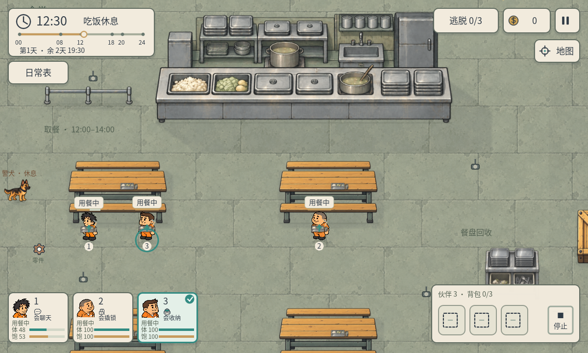

# P43 · 地图4食堂改装

2026-10-05。用户确认A13朴素配餐概念，要求按设计改装地图4食堂。程序/地图由制作人任务`6111af3a-de2a-4d09-8c37-48caa1697c98`承担，透明素材由主美A14任务`c2c6c499-e6e9-4568-b807-7a71c92c1eab`交付并独立验收。

## 空间和素材

R04下半区活动大厅改为食堂，地图下边界从1500延伸到1840（bounds高度1740）。寝室、工作区、铁门和出口原位置保留；地图3及其他关卡配置不改。

北侧旧金属取餐台与后厨，左侧短排队栏，中部两列四张旧暖木长桌，东侧餐盘回收架。米饭、煮菜/土豆、清汤保持低饱和朴素配给，没有重新放回肉丸和鲜亮拼盘。四张长桌复用原communal_table；桌面餐盘使用新非碰撞装饰。

| 配置 | 逻辑脚印/位置 |
| --- | --- |
| 取餐台 | [960,1110,600,80]，图像向北投影约147 |
| 后厨 | [960,967,600,143]额外隐藏碰撞，覆盖图像后厨范围 |
| 排队栏 | [730,1140,180,12] |
| 回收架 | [1630,1480,110,70]，原图实际绘制约112×106 |
| 四桌 | x=780/1210，y=1290/1590，各200×105 |
| 三取餐点 | [1080,1240]、[1460,1240]、[1040,1240] |
| 三用餐点 | [820,1430]、[1290,1430]、[940,1430] |

上排两桌安排三名伙伴，两人可在同桌分别用餐；分开的餐点减少往返距离，4倍调试流速下从真实工作岗位出发也能赶上午餐。下排两桌和外围通道仍可自由移动。新脚印避开寝室入口至铁门的横向主通道；巡逻实际走完四点、三个寝室午夜查房均通过。

加载`art/props/cafeteria_v14/manifest.json`的统一缩放/裁区局部ground_rect契约，源PNG未改。WorldTexture在素材尚未被编辑器导入时也能读取原图并生成裁区mipmap；保留原有世界材质与平滑镜头。餐盘配置draw_depth，比所属桌子深度高1，解决装饰被桌子盖住的问题；角色仍按脚点排序。厨房隐藏碰撞不额外画墙顶或阴影。

## 午餐玩法

R04日常表新增“吃饭”，仅12:00–14:00可安排。按表行动先走自己的取餐点，领取后拿着餐盘走到饭桌。站在真实用餐点、停止移动/技能且处于午餐时间才恢复饱腹和体力；头上显示“用餐中”、饱腹度条及轻微进食动作。

玩家也能在午餐时间靠近窗口点击“取餐”图标或按E，临时开始当前伙伴的取餐/用餐流程，无需占用背包格，也不扣钱。临时取餐不修改日常表草稿；手动移动或停止会接管并取消用餐，14:00后时段切换清理餐盘及进食状态。

R04寝室休息只恢复体力，午饭改在食堂。其他地图沿用既有寝室午休进食，新增吃饭选项在无食堂关卡隐藏。餐盘回收架这轮是场景摆设，没有新增回收收益、交易或厨师NPC系统。

暂停、时间流速0、终局不继续进食。属性按游戏分钟只结算一次，14:00边界截断饱腹恢复；跨天清晨排班、午夜睡觉、跳夜规则不变。午餐恢复速率沿用data/attributes.json，没有修改数值。重开清理进食状态并恢复开局100体力/80饱腹。

## 实际验证

- `qa/p43_cafeteria.gd`：31项，含实际赴工作岗位、工资、三人取餐后就餐、4倍流速赶上午餐、全天巡逻完整路径、桌点/物品可达、厨房碰撞、途中/寝室不空吃、暂停/时间0/防重复、14点切换、旧图兼容与重开。
- `qa/p43_gate_regression.gd`：20项，保留两名铁门守卫聊天配合、阻止撬锁/通行、夜间撤岗、只买入交易规则。
- `qa/p43_multiday_regression.gd`：36项，三天期限、实际三寝室查房与开门、午夜锁门/晚间安全区、跳夜、跨天排班与终局。
- `qa/p43_native_cafeteria.gd`：1200×720及960×540各26项，Windows D3D12真实渲染/触控安排、两种尺寸菜单与底部按钮无冲突、三人实际到餐、手动取餐、托盘不占背包、桌面排序/mipmap、白天与夜晚、其他地图四种选项。

程序共139项通过。阶段时钟跳转、低属性和“站在窗口手动取餐”的位置为明确fixture；行进/工资/取餐和到饭桌实际模拟，未做Android/iOS真机或真人趣味性测试。QA显式设置窗口/逻辑画布尺寸，避免stretch expand让960物理窗口仍是1280逻辑画布。

复现：Godot4.7.2控制台运行`--headless --path . --script qa/p43_cafeteria.gd`；原生运行`--path . --script qa/p43_native_cafeteria.gd -- 1200 720`或`-- 960 540`。

保留project.godot现有用户差异及流速/天数偏好，没有更改编辑器配置、既有源PNG或其它地图数据。
