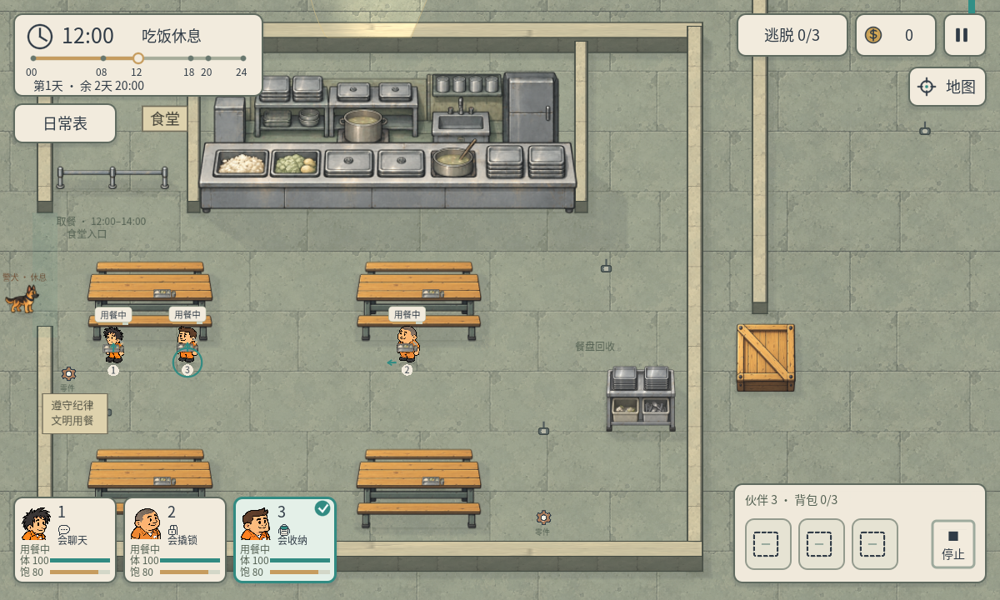
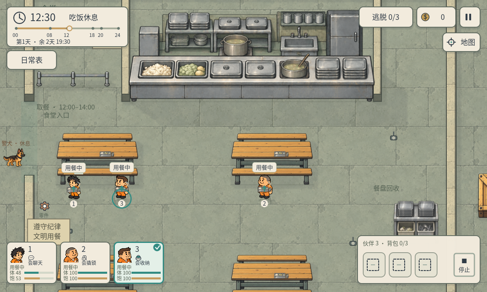

# P44 · 围合食堂房间

2026-10-05，制作人任务`40f6576a-d8d7-422d-897c-8a330019c9d1`。用户指出P43只摆放了取餐架，要求还原参考图的围合房间，并授权修改地图布局。本轮重点修正建筑结构，复用既有墙材质和A14食堂素材。

## 实际改装

R04食堂外框[700,910,1064,854]，北/东/南三侧连续实体墙，西侧墙分两段，入口留[700,1190,24,200]。寝室旁西通道和铁门旁东通道留出可通行的宽度，按20单位寻路网格与17单位人物半径验证。

取餐台两侧新增[940,934,20,256]、[1560,934,20,256]隔墙，向北连接外墙，向南抵到取餐台脚印；后厨因此成为封闭服务间。台后原有家具碰撞继续保留，玩家不能穿越台面或从旁边钻入后厨。墙体同时遮挡视线与灯光，不是仅画外框。

保留四张长桌、短排队栏、朴素餐盘；回收架移到[1610,1470,110,70]，避免与东墙重叠；补充食堂墙牌、入口提示和纪律牌，食堂地面分区收进墙内。其他地图、原PNG、角色/背包/属性/日程规则未改。

## 真实动线和验证

- `qa/p44_cafeteria.gd`43项：围墙四侧/后厨碰撞、墙体视线遮挡、入口开放；三人实际穿入口取餐用餐并返回寝室；正常1倍时钟从真实岗位出发在午餐时段到餐；全天四点巡逻、商人实际工作和营业路线；工资、属性结算、暂停、时段切换、其他地图兼容。
- `qa/p44_gate_regression.gd`20项：铁门守卫配合、通行/撬锁限制、夜间撤岗、只买入交易。
- `qa/p44_multiday_regression.gd`36项：实际三寝室查房/钥匙开门、睡觉/跳夜、三天期限和跨天排班。
- `qa/p44_native_cafeteria.gd`1200×720及960×540各29项：Windows D3D12渲染/真实触控、墙体渲染节点、实际取餐、正常镜头恢复、昼夜与UI。

程序共157项通过。商人工作路线使用固定晨间阶段、真实NPC位移；阶段选择和低属性是明确fixture。没有真人/Android/iOS真机测试。围合后路径更长，验证正常1倍流速；较高调试流速不会放大玩家移动速度，不承诺加速模式下所有人仍赶得上每顿饭。没有修改用户流速偏好。

## 画面与试玩

总览仅在QA临时缩小镜头，`qa/p44_camera_probe.gd`用于总览正确裁出整个地面；截图后恢复1倍镜头。正式摄像机没有新增缩放或改动跟随规则。正常画面仍可拖动主图/小地图看整个房间。

CLI复现：Godot4.7.2 `--headless --path . --script qa/p44_cafeteria.gd`；原生`--path . --script qa/p44_native_cafeteria.gd -- 1200 720`或`-- 960 540`。按用户要求，后续验收同步与运行优先使用CLI。

project.godot原有用户差异保留，SHA256仍为C92BE6253B1D9417C3DD019A12ABF986C1D992808EB9313E5D0B14AC87682B7E。
