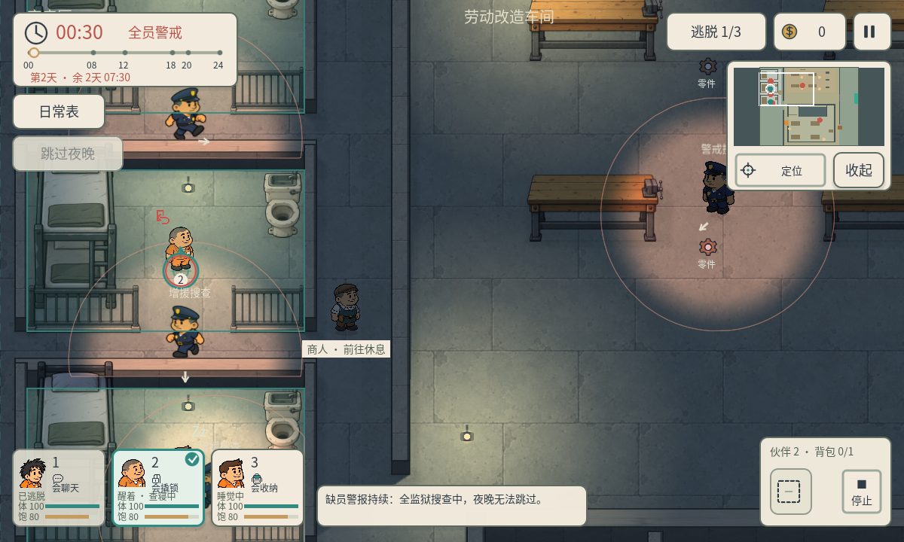
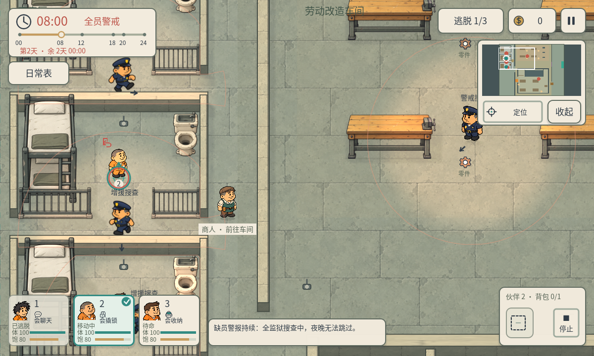

# P45 · 查寝缺员与全监狱警戒

2026-10-05，制作人独立程序任务 `p45-rollcall-alert-20261005`。用户要求查房发现缺员后全员警戒，并派更多警员搜查。本轮通过 CLI 实现、运行和记录。

## 规则

- 午夜由巡警实际进入各自寝室、靠近查点位置并能看见床位后核对人员；隔墙、只到走廊、午夜到点本身都不会直接报警。
- 对应人物不在自己的寝室算缺员，已逃脱也算；人在另一间寝室仍算缺员。在自己寝室内但未睡着不算缺员，现有宵禁醒着被发现的抓捕规则继续存在。警卫停留或再次来查时也会继续核对。
- 首次发现缺员后全监狱持续警戒：原巡警、两名门岗及新增两名警员分路搜查寝室、车间和活动区。其他地图没有两名门岗时，仍增加两名警员。
- 增援从可站立的巡逻入口附近出现，使用真实寻路、墙体/门碰撞、视线、昼夜视距与抓捕；不会传送到人物身边，也不会隔墙锁定位置。警犬同时进入工作状态。多人钥匙位置共同决定寝室门开闭，不会由最后一名警卫关闭另一名正在使用的门。
- 警报持续到本局结束/重开，08:00不会恢复正常警戒；报警期间正常日常安排不再提供免抓保护。午夜在各自床上睡觉的伙伴继续保留睡眠保护。正常局面白天不抓人的规则保留。
- 缺员或报警时不能跳过夜晚，避免通过跳夜绕过查房。人员齐全、归床停止行动仍可正常跳夜。打开日常表暂停整个搜查；结算停止移动；换图/重开清理增援、灯光、路线和警报。

## 表现与接口

时钟阶段显示红色“全员警戒”，增援标“增援搜查”，原警卫标“警戒搜查”；追到人显示“追击！”。额外警员有移动动画、真实遮挡的搜索灯和小地图红点。报警首次显示缺员编号和增派两名警员提示，作息说明与跳夜按钮同步说明警报规则。

新增 `scripts/core/prison_alert.gd` 统一维护报警和增援，`game.snapshot().prison_alert`输出状态、查点、缺员编号、增援和警员数量。复用门岗角色视觉装配与现有 Guard 行为。地图、美术PNG和正式摄像机规则未修改。

## 验证

- `qa/p45_rollcall.gd`：50项，实际走遍三寝室正常查房；截图同类“一人已逃脱”场景等待真实查到其寝室后报警；两名增援真实行走及进入寝室、两名门岗真实离岗搜查；一名增援单独真实寻路抓回人物；多人钥匙、墙体视线、暂停、跳夜限制、跨晨持续、重开清理和其他地图兼容。错误寝室、醒着在房、捕获、多人门钥匙和旧图兼容是明确位置fixture。
- 同脚本 Windows D3D12 1200×720、960×540各50项，记录报警夜间/晨间实际帧缓冲截图。
- `qa/p45_multiday_regression.gd`：36项，原三寝室钥匙查房、正常睡眠/跳夜、多日流程与期限。
- `qa/p45_gate_regression.gd`：20项，正常白天门岗、聊天/撬锁/通行和只买入交易。
- `qa/p45_cafeteria_regression.gd`：43项，围合食堂的真实取餐用餐、返回寝室、巡逻/商人路径与工资/属性。

合计249项。属于程序自测与 Windows 原生渲染验证，没有真人试玩或手机真机测试结论。

CLI：Godot4.7.2 `--headless --path . --script qa/p45_rollcall.gd`；原生 `--path . --script qa/p45_rollcall.gd -- 1200` / `-- 960`。其他回归脚本以 `--headless --path . --script`运行。

原有 `project.godot` 用户差异保持；SHA256：C92BE6253B1D9417C3DD019A12ABF986C1D992808EB9313E5D0B14AC87682B7E。
