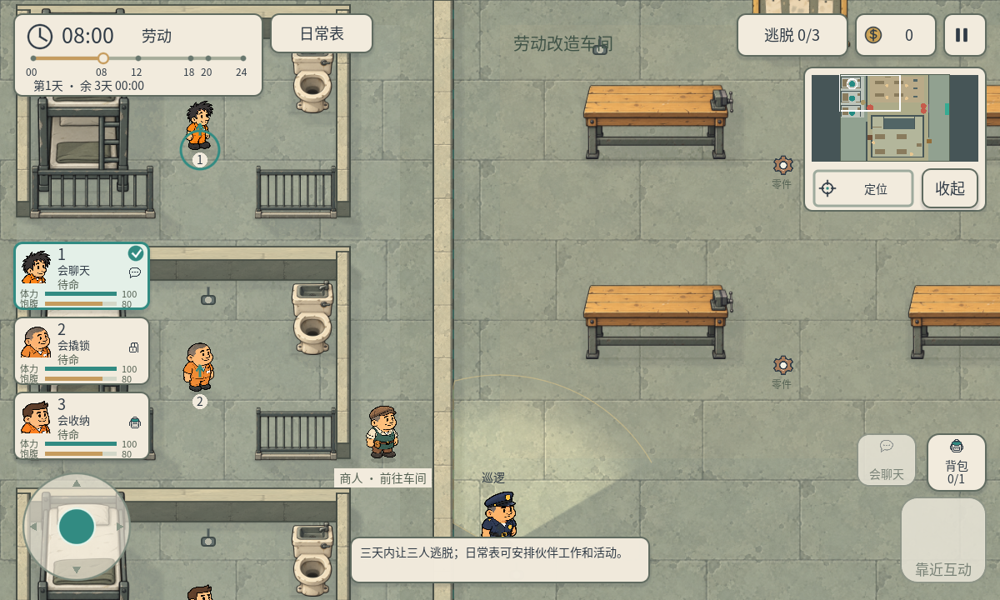
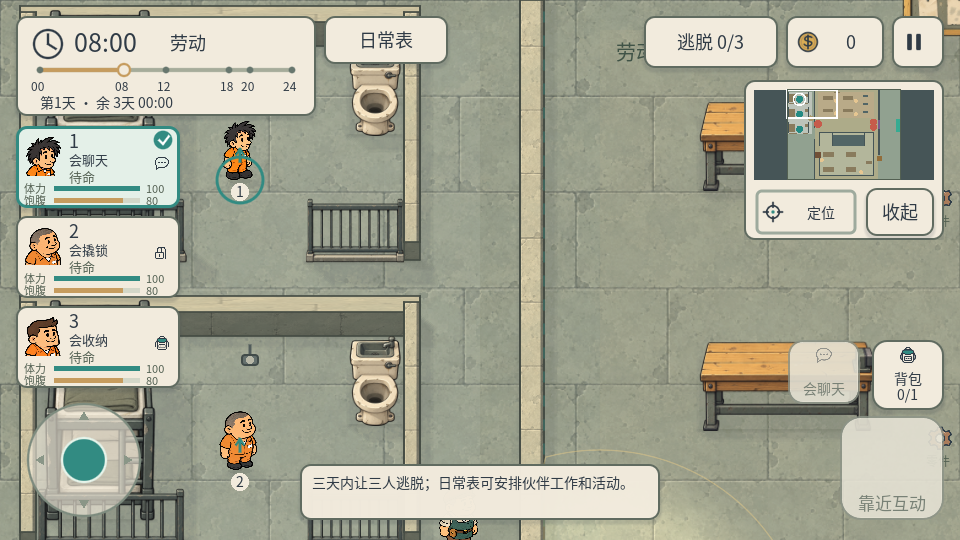
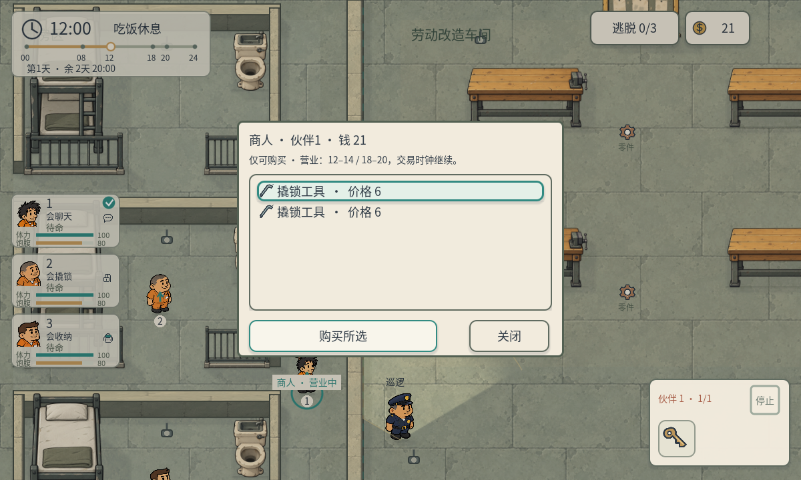

# P46 · 手机摇杆与竖排伙伴栏

2026-10-06。用户批准A15概念，要求将伙伴切换改成左侧竖排，并开始实装。制作人任务 `p46-direct-mobile-control-20261006`，主美兼技术美术任务 `a16-vertical-mobile-hud-20261006`。开工时GameCreator离线，依据用户明确工作包开始；用户启动服务后通过CLI补齐真实分工，使用各自凭证提交反馈，制作人审核A16并单独自验收P46。

## 实装行为

- 左侧三张紧凑竖排伙伴卡，保留原头像、技能角标、状态及体力/饱腹条；已逃脱人物禁用，青绿框标当前控制。左下摇杆松手停止，有中心死区和限幅。右下固定情景主键、当前技能键、背包键；附近多目标可手动切换。
- 摇杆只直接移动当前人物，用原碰撞/移动速度/属性效率，不重复提交寻路请求。大力气接触推箱，出口按原规则判定。日常安排和其他伙伴技能继续；真正移动某人时才接管该人的安排并停止其操作。跨时段新命令不抢走正在操控的人物。
- 点头像切换立即归零移动输入；尚未松开的旧手指继续被消费，必须重新触摸才能移动新人物。原生多指分别捕获移动与按钮，过滤Godot额外仿真鼠标事件，避免背包/技能/目标按钮被触发两次。
- 左右手可同时移动/交互，交互启动时停止当前移动；技能可继续留给伙伴执行。场景旁原可点击浮动按钮由固定右侧键替代。当前仍使用既有目标距离、视线、门岗、聊天、取餐和商店营业判定。
- 主图轻点不下达移动目的地；可轻点人物切换。空白区域仍可拖视野，小地图保留点击/拖动/定位；开始直接移动时恢复跟随。桌面支持鼠标拖摇杆及WASD/方向键移动；S用作向下，停止入口在背包头部。
- 背包默认收起，展开显示当前真实容量和物品操作；展开时禁止摇杆移动但可继续使用背包按钮。商店自动显示真实背包，库存和交易面板互不重叠。日常表/暂停/弹窗/捕获/切图重开/失焦均清空输入，结算隐藏控制。重开同时取消旧按钮按压，防止跨局误触。
- 1200×720和960×540使用锚定布局及既有安全区处理；未修改正式镜头采样/墙材质、原PNG或project.godot，不影响正常白天规则或夜间全员警报。

## 范围和证据

主美维护 `scripts/ui/fullscreen_hud.gd`，制作人维护 `scripts/core/mobile_controls.gd` 及角色入口、镜头输入、睡眠判定、情景交互。共用现有角色、主题、库存和技能，不把概念图切成假界面。

- `qa/p46_mobile_controls.gd`：headless1200共59项；Windows D3D12原生1200×720、960×540各62项。使用`Input.parse_input_event`实际输入路由验证死区、移动/松手、方向、切人/多指、持续工作聊天、技能、物品/目标切换、背包1/3格、真实购买、暂停/失焦/重开、墙/锁门/推箱/出口。原生另验证主图拖动、小地图及定位。商店、门、物品、推箱和出口位置为明确fixture；失焦用窗口信号fixture。主美实际审查游戏帧缓冲截图。
- `qa/p46_rollcall_regression.gd`50项：真实三房查点、缺员报警、增援真实寻路/开门/抓捕，警报跨晨与重开清理。
- `qa/p46_multiday_regression.gd`36项：正常睡眠/钥匙查房、多日/日常分配与期限。
- `qa/p46_gate_regression.gd`20项：门岗配合、聊天/撬锁/通行、只买入交易。
- `qa/p46_cafeteria_regression.gd`43项：围合食堂真实到餐/回寝、工作工资、属性和商人路线。

总计332项通过。属于程序自测和Windows渲染/触控事件模拟，没有Android/iOS真机或真人手感结论。未宣称新增生命值、攻击、奔跑或新的技能规则。

CLI复现：Godot4.7.2 `--headless --path . --script qa/p46_mobile_controls.gd -- 1200`；原生 `--path . --script qa/p46_mobile_controls.gd -- 1200` / `-- 960`。其他四个回归脚本使用 `--headless --path . --script`。按用户偏好优先CLI，并由制作人统一运行，避免两个助手争用游戏输入。

保留原project.godot差异，SHA256：C92BE6253B1D9417C3DD019A12ABF986C1D992808EB9313E5D0B14AC87682B7E。
